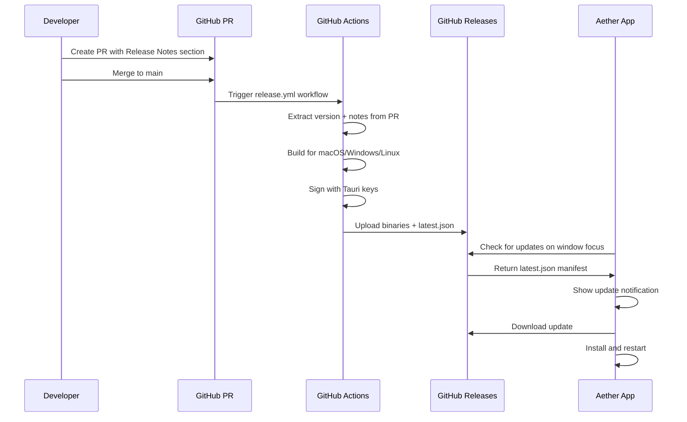

# Aether Auto-Updater Implementation

## Architecture Overview




---

## Phase 1: Repository Setup

### 1.1 Generate Tauri Signing Keys

Run locally (keys stored securely, never committed):

```bash
cd desktop && bun tauri signer generate -w ~/.tauri/aether.key
```

Save the printed public key for `tauri.conf.json`.

### 1.2 Configure Tauri Updater Plugin

**Add dependency to `[desktop/src-tauri/Cargo.toml](desktop/src-tauri/Cargo.toml)`:**

```toml
tauri-plugin-updater = "2"
```

**Update `[desktop/src-tauri/tauri.conf.json](desktop/src-tauri/tauri.conf.json)`:**

- Add `updater` to plugins section with GitHub endpoint and public key
- Add `"updater:default"` to capabilities

**Add frontend package:**

```bash
cd desktop && bun add @tauri-apps/plugin-updater
```

### 1.3 Add GitHub Secrets

In repository Settings > Secrets > Actions:

- `TAURI_SIGNING_PRIVATE_KEY` - contents of `~/.tauri/aether.key`
- `TAURI_SIGNING_PRIVATE_KEY_PASSWORD` - password if set during generation

---

## Phase 2: GitHub Actions Workflow

### 2.1 Create `.github/workflows/release.yml`

The workflow will:

1. Trigger on push to `main`
2. Find merged PR and extract release notes from `## Release Notes` section
3. Skip if no release notes present (allows non-release merges)
4. Build for all platforms (macOS Intel/ARM, Windows, Linux)
5. Sign binaries with Tauri updater signature
6. Create GitHub Release with binaries and `latest.json` manifest

### 2.2 Create `.github/pull_request_template.md`

Template with:

- Description section
- Type of change checkboxes
- **Release Notes** section (only fill to trigger release)
- Testing checklist

---

## Phase 3: Rust Backend

### 3.1 Create Update Module

**New file: `[desktop/src-tauri/src/updater.rs](desktop/src-tauri/src/updater.rs)**`

```rust
// Core types
pub struct UpdateInfo {
    pub current_version: String,
    pub latest_version: String,
    pub changelog: String,
    pub published_at: String,
}

pub struct UpdatePreferences {
    pub auto_check: bool,        // Enable focus-based checking
    pub auto_download: bool,
    pub skipped_versions: Vec<String>,
}
```

### 3.2 Add Updater Commands

**New file: `[desktop/src-tauri/src/commands/updater.rs](desktop/src-tauri/src/commands/updater.rs)**`

Commands to implement:

- `check_for_updates` - Check GitHub for new version
- `download_and_install_update` - Download and apply update
- `skip_version` - Mark version as skipped
- `get_update_preferences` / `set_update_preferences` - Manage preferences
- `get_current_version` - Return app version

### 3.3 Register in lib.rs

**Modify `[desktop/src-tauri/src/lib.rs](desktop/src-tauri/src/lib.rs)`:**

- Add `mod updater;` 
- Register `tauri_plugin_updater::Builder::new().build()`
- Add updater commands to `invoke_handler`
- Add update check in existing `on_window_event` when window gains focus

**Focus-based checking with cooldown** (reuses existing `WindowFocus` pattern):

```rust
// In on_window_event, alongside existing sync-on-focus logic:
WindowEvent::Focused(focused) => {
    if *focused {
        // Existing sync logic...
        
        // Check for updates (with 30-min cooldown to avoid excessive checks)
        let app = window.app_handle().clone();
        tauri::async_runtime::spawn(async move {
            if let Some(manager) = app.try_state::<updater::UpdateManager>() {
                if manager.should_check().await {
                    if let Ok(Some(info)) = manager.check_for_updates().await {
                        let _ = app.emit("update-available", info);
                    }
                }
            }
        });
    }
}
```

This approach:

- Zero startup overhead
- Catches updates when user returns after being away
- Respects 30-min cooldown between checks
- Mirrors existing sync-on-focus pattern

---

## Phase 4: Frontend Implementation

### 4.1 Create Update Types

**New file: `desktop/src/types/updater.ts**`

- `UpdateInfo`, `UpdateProgress`, `UpdatePreferences`, `UpdateState` interfaces

### 4.2 Create Update Hook

**New file: `desktop/src/hooks/use-updater.ts**`

- `useUpdater()` hook wrapping all Tauri commands
- Listen for `update-available` and `update-progress` events
- Manage update state (checking, available, downloading, ready)

### 4.3 Repurpose What's New Section

**Modify `[desktop/src/features/settings/components/whats-new.section.tsx](desktop/src/features/settings/components/whats-new.section.tsx)**`

Transform placeholder into:

- Current version display
- "Check for Updates" button
- Changelog display (markdown rendered)
- Download/Install buttons when update available
- Progress bar during download
- Skip version option

### 4.4 Add Update Notification

**New file: `desktop/src/components/shared/update-notification.tsx**`

Toast-style notification that appears when update is detected:

- Shows version number
- "View Changes" opens Settings > What's New
- "Later" dismisses temporarily
- Uses existing `sonner` toast library

### 4.5 Add Updates Section to Settings

**Modify `[desktop/src/features/settings/settings.view.tsx](desktop/src/features/settings/settings.view.tsx)**`

Add "Updates" section with preferences:

- Automatic update checks (toggle) - enables/disables focus-based checking
- Auto-download updates (toggle)
- Skipped versions list with clear option

---

## Phase 5: Key Files Summary


| File                                                             | Action | Purpose                    |
| ---------------------------------------------------------------- | ------ | -------------------------- |
| `desktop/src-tauri/Cargo.toml`                                   | Modify | Add `tauri-plugin-updater` |
| `desktop/src-tauri/tauri.conf.json`                              | Modify | Add updater config         |
| `desktop/src-tauri/src/updater.rs`                               | Create | Update types and manager   |
| `desktop/src-tauri/src/commands/updater.rs`                      | Create | Tauri commands             |
| `desktop/src-tauri/src/lib.rs`                                   | Modify | Register plugin + commands |
| `.github/workflows/release.yml`                                  | Create | CI/CD workflow             |
| `.github/pull_request_template.md`                               | Create | PR template                |
| `desktop/src/types/updater.ts`                                   | Create | TypeScript types           |
| `desktop/src/hooks/use-updater.ts`                               | Create | React hook                 |
| `desktop/src/features/settings/components/whats-new.section.tsx` | Modify | Changelog UI               |
| `desktop/src/components/shared/update-notification.tsx`          | Create | Toast notification         |


---

## Notes

- **Tauri 2.0**: Uses `tauri-plugin-updater` (not the Tauri 1.x built-in updater)
- **Package Manager**: Project uses `bun`, not npm
- **Existing UI**: Leverages existing Settings view and What's New placeholder
- **Focus-based Checks**: Updates checked when window gains focus (30-min cooldown), zero startup overhead
- **User Control**: Users always confirm before downloading/installing

