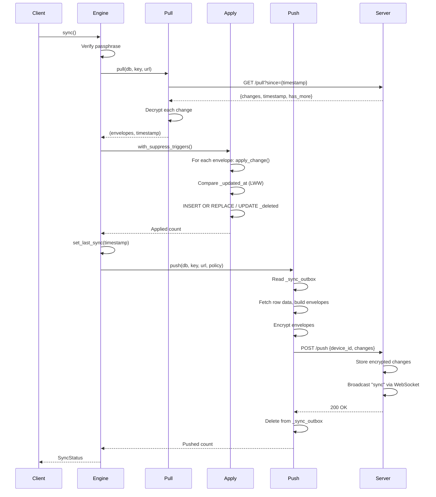
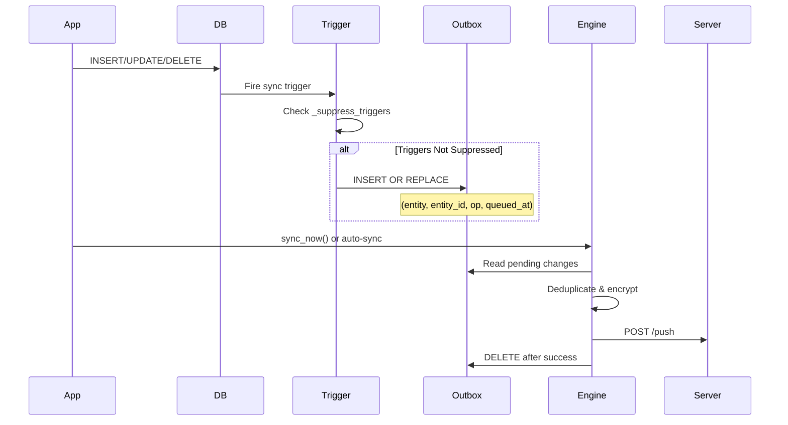

# Aether Sync Feature Plan

## Overview

Aether implements an **offline-first, end-to-end encrypted sync system** that enables multi-device synchronization through a user-deployed Docker server. The system uses last-write-wins conflict resolution, content-addressed media storage, and SQLite triggers for automatic change tracking.

### Key Characteristics

- **Offline-first**: Works without network connection; changes queue locally
- **End-to-end encrypted**: All data encrypted client-side; server stores only opaque blobs
- **User-deployed**: Users run their own sync server (Docker)
- **Last-write-wins**: Conflict resolution based on `_updated_at` timestamps
- **Automatic change tracking**: SQLite triggers capture all local changes

## Architecture

```mermaid
graph TB
    subgraph Client[Desktop Client]
        DB[(SQLite Database)]
        Triggers[SQLite Triggers]
        Outbox[_sync_outbox Table]
        Engine[SyncEngine]
        Encrypt[Encryption Module]
        WS[WebSocket Listener]
    end
    
    subgraph Server[Sync Server Docker]
        API[Axum HTTP Server]
        Storage[(SQLite Storage)]
        Blobs[Blob Storage]
        Broadcast[WebSocket Broadcast]
    end
    
    DB -->|Changes| Triggers
    Triggers -->|Queue| Outbox
    Outbox -->|Read| Engine
    Engine -->|Encrypt| Encrypt
    Encrypt -->|POST /push| API
    API -->|Store| Storage
    API -->|Store| Blobs
    API -->|Broadcast| Broadcast
    Broadcast -->|"sync" message| WS
    WS -->|Trigger| Engine
    Engine -->|GET /pull| API
    API -->|Encrypted Changes| Engine
    Engine -->|Decrypt & Apply| DB
```



## Core Components

### Client-Side (`desktop/src-tauri/src/sync/`)

#### 1. **SyncEngine** (`engine.rs`)

- Manages sync lifecycle: configure, sync, status, disconnect, reconnect
- Coordinates pull → apply → push operations
- Maintains server URL and passphrase in memory (passphrase never persisted)
- Tracks sync state (`is_syncing`) to prevent concurrent syncs
- Provides `push_pending()` for window blur events

**Key Methods:**

- `configure()`: First-time setup or reconfiguration
- `sync()`: Full sync operation (pull + apply + push)
- `status()`: Returns connection state, pending changes, last sync time
- `reconnect()`: Re-enter passphrase after app restart
- `hydrate_from_metadata()`: Load server URL on app start

#### 2. **Change Tracking** (`push.rs`)

- Reads from `_sync_outbox` table
- Deduplicates changes by `(entity, entity_id)`
- Fetches full row data for each entity type
- Builds `ChangeEnvelope` objects with entity, id, op, data, updated_at
- Encrypts envelopes before sending to server
- Handles media blob uploads when policy is "auto"

**Supported Entities:**

- Core: `entries`, `tags`, `tasks`, `goals`, `canvases`, `bookmarks`
- Media: `media_items`, `audio_transcriptions`
- Relations: `entry_tags`, `task_tags`, `goal_tags`, `goal_instance_tags`, `bookmark_tags`
- Hierarchies: `goal_instances`, `subtasks`

#### 3. **Change Application** (`apply.rs`)

- Implements last-write-wins conflict resolution
- Compares local `_updated_at` vs remote `updated_at`
- Skips changes where local timestamp is newer or equal
- Uses `_suppress_triggers` flag to prevent re-queuing applied changes
- Handles upsert and soft-delete operations
- Downloads media blobs when policy is "auto"

**Conflict Resolution Logic:**

```rust
if local_updated_at >= remote_updated_at {
    skip_change() // Local is newer or equal
} else {
    apply_change() // Remote is newer
}
```

#### 4. **Encryption** (`encryption.rs`)

- **Key Derivation**: Argon2id from passphrase + salt
- **Transport Encryption**: ChaCha20-Poly1305 (AEAD)
- **Key Storage**: Only salt and key_check hash stored; passphrase never persisted
- **Blob Encryption**: Same cipher, nonce prepended to ciphertext

**Security Properties:**

- 32-byte keys derived with Argon2id
- 12-byte random nonces per encryption
- Base64 encoding for transport
- SHA-256 key check hash for verification

#### 5. **Metadata Management** (`metadata.rs`)

- Stores sync configuration in `_sync_meta` table
- Keys: `device_id`, `server_url`, `last_sync`, `key_salt`, `key_check`, `_suppress_triggers`
- Generates unique device ID (UUID) on first use
- Manages trigger suppression flag

#### 6. **Media Sync** (`media.rs`)

- Content-addressed storage: `sha256:{hex}` hash
- Two sync policies: `auto` (full sync) and `on_demand` (metadata only)
- `ensure_media_blob()`: Downloads missing media on-demand
- Hash stored in `media_items.metadata.content_hash`

#### 7. **WebSocket Listener** (`ws.rs`)

- Connects to sync server `/ws` endpoint
- Listens for "sync" messages from server
- Triggers sync operation on message
- Auto-reconnects with exponential backoff (1s → 60s max)

### Server-Side (`sync-server/`)

#### 1. **HTTP API** (`handlers.rs`)

- **POST /push**: Receives encrypted changes, stores in SQLite
- **GET /pull**: Returns encrypted changes since timestamp
- **PUT /media/:hash**: Upload encrypted blob
- **GET /media/:hash**: Download encrypted blob
- **HEAD /media/:hash**: Check blob existence
- **GET /health**: Health check
- **GET /ws**: WebSocket upgrade for real-time notifications

#### 2. **Storage** (`storage.rs`)

- SQLite database for encrypted changes
- File system for blob storage (`{data}/blobs/{hash}`)
- Tracks `received_at` timestamps for pull queries
- Pagination: 500 changes per pull request

**Schema:**

```sql
CREATE TABLE changes (
    id INTEGER PRIMARY KEY,
    device_id TEXT NOT NULL,
    nonce BLOB NOT NULL,
    ciphertext BLOB NOT NULL,
    received_at INTEGER NOT NULL
);

CREATE TABLE blobs (
    hash TEXT PRIMARY KEY,
    size INTEGER NOT NULL,
    uploaded_at INTEGER NOT NULL
);
```

## Data Flow

### Sync Operation Flow



### Change Tracking Flow



## Database Schema

### Sync Infrastructure Tables

**`_sync_outbox`**: Queues local changes for push

```sql
CREATE TABLE _sync_outbox (
    entity TEXT NOT NULL,
    entity_id TEXT NOT NULL,
    op TEXT NOT NULL CHECK(op IN ('upsert', 'delete')),
    queued_at INTEGER NOT NULL,
    UNIQUE(entity, entity_id)
);
```

**`_sync_meta`**: Stores sync configuration

```sql
CREATE TABLE _sync_meta (
    key TEXT PRIMARY KEY,
    value TEXT NOT NULL
);
```

**`_sync_unknown`**: Forward compatibility for unknown entities

```sql
CREATE TABLE _sync_unknown (
    entity TEXT NOT NULL,
    entity_id TEXT NOT NULL,
    data TEXT NOT NULL,
    updated_at INTEGER NOT NULL,
    PRIMARY KEY (entity, entity_id)
);
```

### Sync Columns on All Tables

Every synced table includes:

- `_sync_id TEXT PRIMARY KEY`: Unique sync identifier (replaces `id` as primary key)
- `_updated_at INTEGER NOT NULL`: Timestamp in milliseconds (for LWW)
- `_deleted INTEGER DEFAULT 0`: Soft delete flag
- `_extra TEXT DEFAULT '{}'`: Forward compatibility JSON

**Tables with sync support:**

- `entries`, `tags`, `tasks`, `goals`, `goal_instances`, `subtasks`
- `media_items`, `audio_transcriptions`
- `canvases`, `bookmarks`
- `entry_tags`, `task_tags`, `goal_tags`, `goal_instance_tags`, `bookmark_tags`

### SQLite Triggers

Triggers automatically queue changes to `_sync_outbox`:

- **INSERT trigger**: Queues 'upsert' operation
- **UPDATE trigger**: Queues 'upsert' when `_updated_at` changes
- **DELETE trigger**: Queues 'delete' when `_deleted` changes from 0 to 1

Triggers check `_suppress_triggers` flag to avoid re-queuing during apply phase.

## Security Model

### Encryption

1. **Key Derivation**:

   - Passphrase (min 12 chars) + random salt → Argon2id → 32-byte key
   - Salt stored in `_sync_meta.key_salt` (hex-encoded)
   - Key check hash (SHA-256 of key) stored in `_sync_meta.key_check`

2. **Transport Encryption**:

   - ChaCha20-Poly1305 (AEAD cipher)
   - Random 12-byte nonce per change
   - Base64-encoded for JSON transport

3. **Blob Encryption**:

   - Same ChaCha20-Poly1305 cipher
   - Nonce prepended to ciphertext (12 bytes + encrypted data)

### Security Guarantees

- **Server cannot decrypt**: Only stores encrypted blobs
- **Passphrase never sent**: Only stored in memory, never persisted
- **Key verification**: Passphrase verified via key_check hash before sync
- **Forward secrecy**: Each encryption uses unique nonce
- **Authentication**: Passphrase required for all operations

### Production Considerations

- Use HTTPS/WSS in production (put server behind TLS reverse proxy)
- Strong passphrases recommended (12+ characters)
- Salt and key_check stored in database (protected by app security)

## API & Commands

### Tauri Commands (`desktop/src-tauri/src/commands/sync.rs`)

1. **`configure_sync`**

   - Parameters: `{server_url, passphrase}`
   - Validates: URL not empty, passphrase ≥ 12 chars
   - First run: Generates salt, derives key, stores key material
   - Subsequent: Verifies passphrase matches stored key_check

2. **`sync_now`**

   - Triggers full sync: pull → apply → push
   - Returns: `SyncStatus` with pending count, last sync time
   - Emits: `sync-status` event to frontend

3. **`get_sync_status`**

   - Returns: `{connected, pending_changes, last_sync, needs_passphrase}`
   - No network calls; reads from local state and database

4. **`disconnect_sync`**

   - Clears server URL and passphrase from memory
   - Does not delete sync metadata (allows reconnect)

5. **`reconnect_sync`**

   - Parameters: `{passphrase}`
   - Re-verifies passphrase and loads into memory
   - Used after app restart when `needs_passphrase = true`

6. **`ensure_media_blob`**

   - Parameters: `mediaId` (path param)
   - Downloads missing media blob when policy is "on_demand"
   - No-op when policy is "auto" or sync not configured

### Server Endpoints

- **POST /push**: `{device_id, changes: [{nonce, ciphertext}]} `→ `200 OK`
- **GET /pull?since={ts}**: → `{changes: [{nonce, ciphertext}], timestamp, has_more}`
- **PUT /media/:hash**: Raw encrypted blob → `200 OK`
- **GET /media/:hash**: → Raw encrypted blob (`200 OK` or `404`)
- **HEAD /media/:hash**: → `200 OK` or `404`
- **GET /ws**: WebSocket upgrade → Receives "sync" messages
- **GET /health**: → `"ok"`

## Configuration

### Settings

**`sync.media_sync_policy`** (default: `"on_demand"`):

- `"auto"`: Full media sync during sync operations
- `"on_demand"`: Only metadata synced; blobs downloaded when needed

### Setup Process

1. **Deploy sync server**:
   ```bash
   cd sync-server && docker compose up -d
   ```

2. **Configure in Aether**:

   - Settings → Sync
   - Enter server URL: `http://your-host:8080`
   - Enter passphrase: min 12 characters
   - Save configuration

3. **First sync**:

   - Click "Sync now" or wait for automatic sync
   - Key material generated and stored
   - Changes pushed to server

## Media Sync

### Content Addressing

- Media files hashed with SHA-256: `sha256:{hex}`
- Hash stored in `media_items.metadata.content_hash`
- Server stores blobs by hash: `PUT/GET /media/{hash}`

### Sync Policies

**Auto Policy** (`sync.media_sync_policy = "auto"`):

- Media blobs uploaded during push phase
- Media blobs downloaded during apply phase
- Full media transferred on every sync

**On-Demand Policy** (`sync.media_sync_policy = "on_demand"` - default):

- Only metadata synced (file_path, content_hash)
- Blobs downloaded when needed via `ensure_media_blob(mediaId)`
- Reduces bandwidth and storage

### Usage

**Audio**: `get_audio_data()` automatically calls `ensure_media_blob()` if needed.

**Images/Video**: Frontend should call `ensure_media_blob(mediaId)` or use `useEnsureMediaBlob(mediaId)` hook before displaying media when policy is "on_demand".

## WebSocket Support

### Real-Time Sync Notifications

- Server broadcasts "sync" message after receiving push
- Client WebSocket listener triggers sync operation
- Enables near-instant sync across devices

### Connection Management

- Auto-connects when server URL configured
- Exponential backoff on disconnect (1s → 60s max)
- Reconnects automatically
- No-op when sync not configured

## Current Implementation Status

### Fully Implemented

- ✅ Core sync engine (pull, apply, push)
- ✅ End-to-end encryption (Argon2id + ChaCha20-Poly1305)
- ✅ Last-write-wins conflict resolution
- ✅ Automatic change tracking via SQLite triggers
- ✅ All entity types supported (entries, tags, tasks, goals, etc.)
- ✅ Junction tables (entry_tags, task_tags, etc.)
- ✅ Hierarchical entities (goal_instances, subtasks)
- ✅ Media sync with content addressing
- ✅ On-demand media download
- ✅ WebSocket real-time notifications
- ✅ Reconnect after app restart
- ✅ Status tracking and pending changes count
- ✅ Trigger suppression during apply
- ✅ Forward compatibility (_sync_unknown table)

### Known Limitations

- Server stores all changes indefinitely (no cleanup/pruning)
- No conflict resolution UI (automatic LWW only)
- No sync history or rollback
- Media blobs not deduplicated on server (same hash = separate storage)
- No bandwidth throttling or resume for large media files
- WebSocket reconnection may miss messages during disconnect
- No multi-account support (single passphrase per database)

## File Structure

### Client Code

- `desktop/src-tauri/src/sync/engine.rs` - Main sync engine
- `desktop/src-tauri/src/sync/push.rs` - Change pushing logic
- `desktop/src-tauri/src/sync/pull.rs` - Change pulling logic
- `desktop/src-tauri/src/sync/apply.rs` - Change application with LWW
- `desktop/src-tauri/src/sync/encryption.rs` - Encryption/decryption
- `desktop/src-tauri/src/sync/metadata.rs` - Metadata management
- `desktop/src-tauri/src/sync/media.rs` - Media blob handling
- `desktop/src-tauri/src/sync/ws.rs` - WebSocket listener
- `desktop/src-tauri/src/sync/types.rs` - Wire protocol types
- `desktop/src-tauri/src/commands/sync.rs` - Tauri command handlers

### Server Code

- `sync-server/src/main.rs` - Server entry point
- `sync-server/src/handlers.rs` - HTTP/WebSocket handlers
- `sync-server/src/storage.rs` - SQLite storage layer
- `sync-server/src/models.rs` - Request/response types

### Database Migrations

- `desktop/src-tauri/migrations/012_add_sync_infrastructure_tables.sql` - Outbox and meta tables
- `desktop/src-tauri/migrations/013_add_sync_columns_to_tables.sql` - Sync columns on all tables
- `desktop/src-tauri/migrations/014_add_sync_triggers.sql` - Change tracking triggers

## Testing Considerations

### Manual Testing

1. **Multi-device sync**:

   - Configure sync on Device A
   - Create/update/delete entries on Device A
   - Configure sync on Device B (same passphrase)
   - Sync on Device B, verify changes appear

2. **Conflict resolution**:

   - Edit same entry on two devices
   - Sync both; verify last-write-wins behavior

3. **Media sync**:

   - Test "auto" policy: verify blobs transfer
   - Test "on_demand" policy: verify metadata sync, blob download on access

4. **WebSocket**:

   - Push change on Device A
   - Verify Device B receives "sync" message and auto-syncs

### Diagnostic Commands

- `check_sync_triggers`: Inspect trigger state and outbox
- `test_sync_trigger`: Manually test trigger firing

## Future Enhancements (Not Implemented)

- Conflict resolution UI (show conflicts, manual merge)
- Sync history and rollback
- Server-side change pruning/cleanup
- Bandwidth throttling and resume
- Multi-account support
- Sync statistics and monitoring
- Partial sync (sync specific entities only)
- Sync groups/sharing