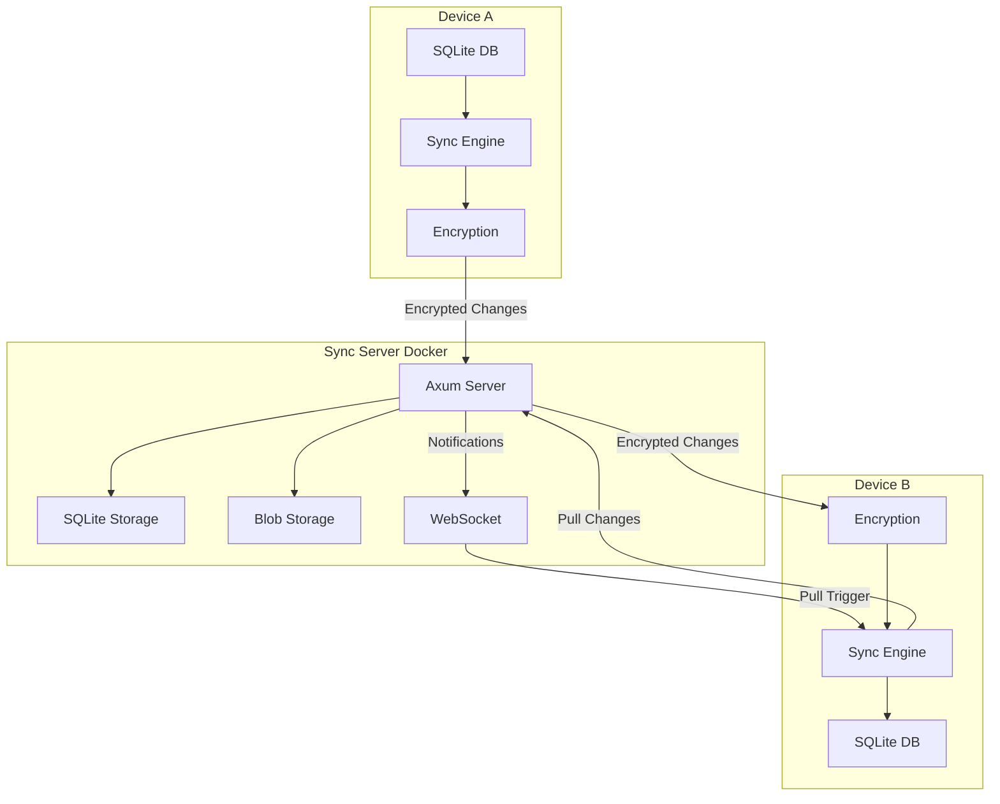

# Aether Sync Implementation Plan

## Overview

This plan implements an offline-first sync system that enables multi-device synchronization for the Aether application. The system uses E2E encryption, last-write-wins conflict resolution, and a user-deployed Docker server.

## Architecture




## Phase 1: Schema & Outbox

### 1.1 Add Sync Columns to All Tables

**Files to modify:**

- `desktop/src-tauri/src/db/schema.rs` (update schema creation to include sync columns)

**Changes:**

- Use `_sync_id TEXT PRIMARY KEY` for all synced tables (instead of `id`)
- Add `_updated_at INTEGER NOT NULL` (milliseconds since epoch)
- Add `_deleted INTEGER DEFAULT 0` (soft delete flag)
- Add `_extra TEXT DEFAULT '{}'` (forward compatibility JSON)
- Add `_version INTEGER DEFAULT 1` (optional optimistic locking)

**Tables to update:**

- `entries`
- `tasks`
- `goals`
- `goal_instances`
- `tags`
- `media_items`
- `audio_transcriptions`
- `bookmarks`
- `canvases`
- `subtasks`
- `entry_tags`, `goal_tags`, `task_tags`, etc. (junction tables)

**Note:** Since this is a fresh schema, we can directly include sync columns in the initial table definitions. No migration needed.

### 1.2 Create Sync Infrastructure Tables

**Files to modify:**

- `desktop/src-tauri/src/db/schema.rs` (add sync tables to schema creation)

Add the following tables to `create_schema()`:

```sql
-- Sync outbox for queuing changes
CREATE TABLE IF NOT EXISTS _sync_outbox (
    id INTEGER PRIMARY KEY AUTOINCREMENT,
    entity TEXT NOT NULL,
    entity_id TEXT NOT NULL,
    op TEXT NOT NULL CHECK(op IN ('upsert', 'delete')),
    queued_at INTEGER NOT NULL,
    UNIQUE(entity, entity_id)
);

CREATE INDEX IF NOT EXISTS idx_sync_outbox_queued ON _sync_outbox(queued_at);

-- Sync metadata storage
CREATE TABLE IF NOT EXISTS _sync_meta (
    key TEXT PRIMARY KEY,
    value TEXT NOT NULL
);

-- Unknown entities from newer clients
CREATE TABLE IF NOT EXISTS _sync_unknown (
    entity TEXT NOT NULL,
    entity_id TEXT NOT NULL,
    data TEXT NOT NULL,
    updated_at INTEGER NOT NULL,
    PRIMARY KEY (entity, entity_id)
);
```

### 1.3 Create Change Tracking Triggers

**Files to modify:**

- `desktop/src-tauri/src/db/schema.rs` (add triggers after table creation)

Create triggers for each synced table in `create_schema()`:

- `AFTER INSERT` → queue upsert to `_sync_outbox`
- `AFTER UPDATE` → queue upsert (when `_updated_at` changes, skip sync-applied updates)
- `AFTER UPDATE` → queue delete (when `_deleted` changes from 0 to 1)

**Example trigger pattern:**

```sql
CREATE TRIGGER entries_sync_insert AFTER INSERT ON entries
BEGIN
    INSERT OR REPLACE INTO _sync_outbox (entity, entity_id, op, queued_at)
    VALUES ('entries', NEW._sync_id, 'upsert', (strftime('%s','now') * 1000));
END;

CREATE TRIGGER entries_sync_update AFTER UPDATE ON entries
WHEN NEW._updated_at != OLD._updated_at  -- skip sync-applied updates
BEGIN
    INSERT OR REPLACE INTO _sync_outbox (entity, entity_id, op, queued_at)
    VALUES ('entries', NEW._sync_id, 'upsert', (strftime('%s','now') * 1000));
END;

CREATE TRIGGER entries_sync_delete AFTER UPDATE ON entries
WHEN NEW._deleted = 1 AND OLD._deleted = 0
BEGIN
    INSERT OR REPLACE INTO _sync_outbox (entity, entity_id, op, queued_at)
    VALUES ('entries', NEW._sync_id, 'delete', (strftime('%s','now') * 1000));
END;
```

**Note:** Use soft deletes (`_deleted = 1`) instead of `AFTER DELETE` triggers so deletions sync properly.

### 1.4 Update Models

**Files to modify:**

- `desktop/src-tauri/src/db/models.rs` (add sync fields to structs)

Add sync fields to all model structs:

- `_sync_id: String`
- `_updated_at: i64` (milliseconds)
- `_deleted: bool`
- `_extra: Option<serde_json::Value>`

### 1.5 Update Repositories

**Files to modify:**

- All files in `desktop/src-tauri/src/db/repositories/`

Update repository methods to:

- Use `_sync_id` instead of `id` for primary keys
- Set `_updated_at` on create/update
- Handle soft deletes via `_deleted` flag
- Store unknown fields in `_extra`

**Testing:**

- Verify local CRUD operations still work
- Verify triggers fire correctly
- Verify outbox is populated on changes

---

## Phase 2: Sync Engine Core

### 2.1 Encryption Module

**New file:** `desktop/src-tauri/src/sync/encryption.rs`

Implement:

- `derive_key(passphrase, salt)` using Argon2id
- `encrypt(key, plaintext)` using ChaCha20-Poly1305
- `decrypt(key, nonce, ciphertext)` using ChaCha20-Poly1305
- `verify_key(key, stored_hash)` for passphrase validation

**Dependencies to add to `Cargo.toml`:**

- `argon2`
- `chacha20poly1305`
- `rand`

### 2.2 Sync Metadata Management

**New file:** `desktop/src-tauri/src/sync/metadata.rs`

Functions:

- `get_device_id()` → generate/store UUID
- `get_server_url()` → read from `_sync_meta`
- `set_server_url(url)` → write to `_sync_meta`
- `get_last_sync()` → read timestamp
- `set_last_sync(timestamp)` → write timestamp
- `get_key_salt()` → read/generate salt
- `get_key_check()` → read/generate hash
- `set_key_check(hash)` → store hash

### 2.3 Change Envelope Types

**New file:** `desktop/src-tauri/src/sync/types.rs`

```rust
#[derive(Serialize, Deserialize)]
pub struct ChangeEnvelope {
    pub entity: String,
    pub id: String,
    pub op: ChangeOp,
    pub data: Option<serde_json::Value>,
    pub updated_at: i64,
}

#[derive(Serialize, Deserialize)]
pub enum ChangeOp {
    Upsert,
    Delete,
}

#[derive(Serialize, Deserialize)]
pub struct PushRequest {
    pub device_id: String,
    pub changes: Vec<EncryptedChange>,
}

#[derive(Serialize, Deserialize)]
pub struct EncryptedChange {
    pub nonce: String,      // base64
    pub ciphertext: String, // base64
}

#[derive(Serialize, Deserialize)]
pub struct PullResponse {
    pub changes: Vec<EncryptedChange>,
    pub timestamp: i64,
    pub has_more: bool,
}
```

### 2.4 Push Implementation

**New file:** `desktop/src-tauri/src/sync/push.rs`

Flow:

1. Read all rows from `_sync_outbox`
2. Group by `(entity, entity_id)` (dedupe)
3. For each unique entry:
  - Read current row from entity table
  - Build `ChangeEnvelope` with full row data
  - Encrypt envelope
4. POST to `/push` endpoint
5. On success: delete from outbox
6. Handle errors with retry logic

**Files to modify:**

- `desktop/src-tauri/src/commands/mod.rs` (add sync commands)
- `desktop/src-tauri/src/commands/sync.rs` (new file)

### 2.5 Pull Implementation

**New file:** `desktop/src-tauri/src/sync/pull.rs`

Flow:

1. GET `/pull?since={last_sync}`
2. For each encrypted change:
  - Decrypt to `ChangeEnvelope`
  - Skip if `device_id` matches local device
  - Apply using LWW logic
  - Store unknown fields in `_extra` for forward compatibility
3. Update `last_sync` timestamp
4. If `has_more`: repeat pagination

**Forward compatibility:** When applying payload, separate known columns from unknown fields. Store unknown fields in `_extra` JSON. Store unknown tables in `_sync_unknown` for later migration.

### 2.6 Last-Write-Wins Application

**New file:** `desktop/src-tauri/src/sync/apply.rs`

```rust
fn apply_change(change: ChangeEnvelope, db: &Database) -> Result<()> {
    let local = get_local_row(&change.entity, &change.id, db)?;
    
    match (local, &change.op) {
        (None, ChangeOp::Upsert) => insert_row(change.data),
        (None, ChangeOp::Delete) => Ok(()), // nothing to delete
        (Some(row), _) if change.updated_at <= row._updated_at => {
            // Local is newer, skip
            Ok(())
        },
        (Some(_), ChangeOp::Upsert) => update_row(change.data),
        (Some(_), ChangeOp::Delete) => soft_delete(&change.id),
    }
}
```

**Important:** When applying remote changes, set `_updated_at` to remote value (not current time) to prevent re-triggering outbox.

### 2.7 Sync Scheduler

**New file:** `desktop/src-tauri/src/sync/scheduler.rs`

Implement debounce logic for push operations:

```rust
const DEBOUNCE: Duration = Duration::from_secs(3);

struct SyncScheduler {
    last_write: Instant,
    pending: bool,
}

impl SyncScheduler {
    fn on_local_write(&mut self) {
        self.last_write = Instant::now();
        self.pending = true;
        self.schedule_push(DEBOUNCE);
    }
    
    fn should_push(&self) -> bool {
        self.pending && self.last_write.elapsed() >= DEBOUNCE
    }
    
    fn on_app_background(&mut self) {
        if self.pending {
            self.push_now();  // don't wait for debounce
        }
    }
}
```

**Push triggers:**

- Local write → 3s debounce (batch rapid edits)
- App background → immediate (sync before user switches away)
- App close → immediate (never lose unsynced data)
- Manual → immediate (user pulls to refresh)

**Pull triggers:**

- WebSocket "sync" message → another device pushed
- App foreground → catch up after being away
- Manual → user pulls to refresh
- After push completes → get any concurrent changes

### 2.8 Sync Engine Coordinator

**New file:** `desktop/src-tauri/src/sync/engine.rs`

Main sync coordinator:

- Integrate scheduler for debounced pushes
- Handle push/pull operations
- Manage WebSocket connection
- Handle network errors gracefully
- Expose sync status
- Integrate with Tauri app lifecycle (background/foreground events)

**Files to modify:**

- `desktop/src-tauri/src/lib.rs` (initialize sync engine)
- Hook into Tauri app lifecycle events for background/foreground

### 2.9 Tauri Integration

**Files to modify:**

- `desktop/src-tauri/src/lib.rs` (manage SyncEngine as Tauri state)
- `desktop/src-tauri/src/main.rs` (add lifecycle hooks)
- `desktop/src-tauri/src/commands/sync.rs` (add Tauri commands)

**State management:**

The `SyncEngine` must be managed as Tauri state using `.manage()`:

```rust
// src-tauri/src/lib.rs or main.rs
let sync_engine = SyncEngine::new(db_state.clone()).await?;

tauri::Builder::default()
    .manage(sync_engine)
    // ...
```

**Lifecycle hooks:**

```rust
// src-tauri/src/main.rs
use tauri::{Manager, WindowEvent};

fn main() {
    tauri::Builder::default()
        .setup(|app| {
            let handle = app.handle().clone();
            
            // Start sync loop on app launch
            tauri::async_runtime::spawn(async move {
                let engine = handle.state::<SyncEngine>();
                engine.run_loop().await;
            });
            
            Ok(())
        })
        .on_window_event(|window, event| {
            let engine = window.state::<SyncEngine>();
            
            match event {
                WindowEvent::Focused(false) => {
                    // Lost focus → flush pending changes
                    tauri::async_runtime::spawn({
                        let engine = engine.inner().clone();
                        async move { engine.push_now().await; }
                    });
                }
                WindowEvent::CloseRequested { .. } => {
                    // Closing → sync synchronously before exit
                    tauri::async_runtime::block_on(async {
                        engine.push_now().await;
                    });
                }
                _ => {}
            }
        })
        .invoke_handler(tauri::generate_handler![
            configure_sync,
            sync_now,
            get_sync_status,
            disconnect_sync,
        ])
        .run(tauri::generate_context!())
        .expect("error running app");
}
```

**Tauri commands:**

```rust
#[tauri::command]
async fn configure_sync(
    engine: State<'_, SyncEngine>,
    server_url: String,
    passphrase: String,
) -> Result<(), String> {
    engine.configure(&server_url, &passphrase).await.map_err(|e| e.to_string())
}

#[tauri::command]
async fn sync_now(engine: State<'_, SyncEngine>) -> Result<SyncStatus, String> {
    engine.sync().await.map_err(|e| e.to_string())
}

#[tauri::command]
async fn get_sync_status(engine: State<'_, SyncEngine>) -> SyncStatus {
    engine.status()
}

#[tauri::command]
async fn disconnect_sync(engine: State<'_, SyncEngine>) -> Result<(), String> {
    engine.disconnect().await.map_err(|e| e.to_string())
}
```

**Event notifications:**

```rust
// In sync engine, notify frontend of status changes
fn emit_sync_status(&self, app: &AppHandle) {
    app.emit("sync-status", self.status()).ok();
}
```

**Testing:**

- Two local databases syncing via mock server
- Test conflict resolution
- Test offline/online transitions
- Test debounce behavior (rapid edits)
- Test app lifecycle triggers (window focus/blur, close)
- Test Tauri commands
- Test event emissions

---

## Phase 3: Sync Server

### 3.1 Server Project Structure

**New directory:** `sync-server/`

```
sync-server/
├── Cargo.toml
├── Dockerfile
├── src/
│   ├── main.rs
│   ├── server.rs
│   ├── storage.rs
│   ├── models.rs
│   └── handlers/
│       ├── push.rs
│       ├── pull.rs
│       ├── media.rs
│       └── websocket.rs
└── docker-compose.yml
```

### 3.2 Server Schema

**File:** `sync-server/src/storage.rs`

```sql
CREATE TABLE IF NOT EXISTS changes (
    id INTEGER PRIMARY KEY,
    device_id TEXT NOT NULL,
    nonce BLOB NOT NULL,
    ciphertext BLOB NOT NULL,
    received_at INTEGER NOT NULL
);

CREATE INDEX idx_changes_time ON changes(received_at);

CREATE TABLE IF NOT EXISTS blobs (
    hash TEXT PRIMARY KEY,
    size INTEGER NOT NULL,
    uploaded_at INTEGER NOT NULL
);
```

### 3.3 Server Endpoints

**File:** `sync-server/src/handlers/mod.rs`

Endpoints:

- `POST /push` → store encrypted changes
- `GET /pull?since={ts}` → retrieve changes since timestamp
- `PUT /media/{hash}` → upload encrypted blob
- `GET /media/{hash}` → download encrypted blob
- `HEAD /media/{hash}` → check blob exists
- `GET /health` → health check
- `WS /ws` → WebSocket for notifications

**Dependencies:**

- `axum` for HTTP server
- `tokio` for async runtime
- `rusqlite` for SQLite
- `tokio-tungstenite` for WebSocket

### 3.4 Blob Storage

**File:** `sync-server/src/storage.rs`

- Store blobs in `{data}/blobs/{hash}` directory
- Content-addressed by SHA-256 hash
- Handle concurrent uploads
- Cleanup orphaned blobs (optional)

### 3.5 WebSocket Notifications

**File:** `sync-server/src/handlers/websocket.rs`

- Register device_id on connection
- Broadcast "sync" message when changes arrive
- No message queuing (devices pull on reconnect)

### 3.6 Docker Packaging

**File:** `sync-server/Dockerfile`

```dockerfile
FROM gcr.io/distroless/cc-debian12
COPY aether-sync /
EXPOSE 8080
VOLUME /data
CMD ["/aether-sync"]
```

**File:** `sync-server/docker-compose.yml`

```yaml
services:
  sync:
    image: aether-sync:latest
    ports: ["8080:8080"]
    volumes: ["./data:/data"]
```

**Testing:**

- Real network sync between two devices
- Test blob upload/download
- Test WebSocket notifications

---

## Phase 4: Media Sync & Real-time

### 4.1 Media Hash Calculation

**Files to modify:**

- `desktop/src-tauri/src/media/storage.rs`

Add function:

```rust
fn media_hash(bytes: &[u8]) -> String {
    let digest = sha256(bytes);
    format!("sha256:{}", hex::encode(digest))
}
```

### 4.2 Media Table Updates

**Files to modify:**

- `desktop/src-tauri/src/db/schema.rs` (update `media_items` table definition)

Update `media_items` table schema to include:

- `hash TEXT NOT NULL` (content-addressed reference, format: `sha256:hex`)
- Blob storage separate: `{app_data}/blobs/{hash}` on client, `{data}/blobs/{hash}` on server

### 4.3 Media Upload/Download

**New file:** `desktop/src-tauri/src/sync/media.rs`

Functions:

- `upload_media(hash, encrypted_blob)` → PUT `/media/{hash}`
- `download_media(hash)` → GET `/media/{hash}`
- `check_media_exists(hash)` → HEAD `/media/{hash}`

### 4.4 Blob Sync Policy

**New file:** `desktop/src-tauri/src/sync/policy.rs`

```rust
enum BlobPolicy {
    Eager,              // download all immediately
    Recent { days: u32 }, // last N days
    OnDemand,           // download when accessed
}
```

Implement sync logic based on policy.

### 4.5 WebSocket Integration

**Files to modify:**

- `desktop/src-tauri/src/sync/engine.rs`
- Connect to WebSocket on sync setup
- Listen for "sync" notifications
- Trigger pull on notification
- Handle reconnection

**Testing:**

- Full flow with media files
- Test different blob policies
- Test real-time sync triggers

---

## Phase 5: UI & Polish

### 5.1 Frontend Tauri Integration

**Files to modify:**

- `desktop/src/features/settings/components/sync.section.tsx`
- Create `desktop/src/hooks/useSync.ts` (new)

**Tauri command usage:**

```typescript
import { invoke } from '@tauri-apps/api/core';

// Configure sync
await invoke('configure_sync', { 
  serverUrl: 'https://my-server.com',
  passphrase: 'my-secret-phrase'
});

// Manual sync
const status = await invoke('sync_now');

// Get status for UI
const status = await invoke('get_sync_status');
// { connected: true, pending_changes: 0, last_sync: 1706123456789 }
```

**Event listener:**

```typescript
// Frontend listens
import { listen } from '@tauri-apps/api/event';

listen('sync-status', (event) => {
  updateSyncIndicator(event.payload);
});
```

**Create React hook:**

```typescript
// desktop/src/hooks/useSync.ts
export function useSync() {
  const [status, setStatus] = useState<SyncStatus | null>(null);
  
  useEffect(() => {
    // Listen for status updates
    const unlisten = listen('sync-status', (event) => {
      setStatus(event.payload as SyncStatus);
    });
    
    // Initial fetch
    invoke('get_sync_status').then(setStatus);
    
    return () => {
      unlisten.then(fn => fn());
    };
  }, []);
  
  return {
    status,
    syncNow: () => invoke('sync_now'),
    configure: (serverUrl: string, passphrase: string) =>
      invoke('configure_sync', { serverUrl, passphrase }),
    disconnect: () => invoke('disconnect_sync'),
  };
}
```

### 5.2 Sync Settings UI

**Files to modify:**

- `desktop/src/features/settings/components/sync.section.tsx`

Add:

- Server URL input
- Passphrase input (with strength indicator)
- Sync status indicator (using `useSync` hook)
- Manual sync button
- Last sync timestamp
- Connection status
- Pending changes count

### 5.3 Sync Status Display

**New component:** `desktop/src/components/sync-status.tsx`

Display:

- Online/offline status
- Pending changes count
- Last sync time
- Sync errors
- Connection indicator

### 5.4 Setup Flow

**Files to modify:**

- `desktop/src/features/settings/components/sync.section.tsx`

Wizard flow:

1. Enter server URL
2. Enter passphrase (with confirmation)
3. Generate device ID (handled by backend)
4. Test connection
5. Initial sync

### 5.5 Error Handling

**Files to modify:**

- `desktop/src-tauri/src/sync/engine.rs`
- `desktop/src/features/settings/components/sync.section.tsx`

**Backend:**

- Retry logic with exponential backoff
- Error messages for common failures
- Network timeout handling
- Wrong passphrase detection
- Emit error events to frontend

**Frontend:**

- Display error messages in UI
- Show retry buttons for failed syncs
- Handle network errors gracefully
- Validate passphrase strength (min 12 chars)

### 5.6 Documentation

**Files to create:**

- `SYNC.md` (user guide)
- `SYNC_DEVELOPMENT.md` (developer guide)
- Update `README.md` with sync setup instructions

**Testing:**

- End-to-end sync flow
- Error scenarios
- UI responsiveness

---

## Schema Considerations

### Forward Compatible Writes

When pushing, merge `_extra` fields back into payload:

```rust
fn build_payload(row: &Row) -> Value {
    let mut obj = row.to_json();
    
    // Merge _extra back into payload
    if let Some(extra) = obj.remove("_extra") {
        for (k, v) in extra.as_object() {
            obj.insert(k, v);
        }
    }
    
    // Remove internal fields
    obj.remove("_updated_at");
    obj.remove("_deleted");
    
    obj
}
```

### Forward Compatible Reads

When pulling, separate known from unknown:

```rust
fn apply_payload(entity: &str, data: Value) -> Row {
    let known_cols = schema.columns(entity);
    let mut row = Row::new();
    let mut extra = json!({});
    
    for (key, value) in data.as_object() {
        if known_cols.contains(key) {
            row.set(key, value);
        } else {
            extra.insert(key, value);
        }
    }
    
    row.set("_extra", extra.to_string());
    row
}
```

### Unknown Tables

Data for unknown tables stored in `_sync_unknown`. On app upgrade, migrate:

```rust
fn post_upgrade_migration() {
    let known = schema.tables();
    
    for (entity, id, data, ts) in db.query("SELECT * FROM _sync_unknown") {
        if known.contains(entity) {
            apply_payload(entity, data);
            db.delete("_sync_unknown", entity, id);
        }
    }
}
```

### Schema Evolution Rules

| Change | Safe | Migration |

|--------|------|-----------|

| Add column with default | ✅ | None needed |

| Add table | ✅ | None needed |

| Remove column | ⚠️ | Stop using, leave in schema |

| Rename column | ❌ | Add new, copy data, deprecate old |

| Change type | ⚠️ | Depends on direction |

### Backward Compatibility

- App continues to work without sync enabled
- Sync is opt-in feature
- No breaking changes to existing APIs

---

## Security Checklist

- HTTPS required for server
- Passphrase strength validation (min 12 chars)
- Rate limiting on server (100 req/min per IP)
- No server-side content logging
- Key verification on connect
- Secure key storage (use OS keychain if available)

---

## Edge Cases

### Clock Skew

Devices may have different clocks. LWW uses timestamps, so this matters.

**Mitigation:** Use hybrid logical clocks (HLC) if needed. For single-user, wall clock is usually fine.

### Large Blobs

Audio files can be large (10s of MB).

**Mitigation:**

- Upload separately from changes
- Resume support for interrupted uploads
- Compress before encryption

### Rapid Edits

User edits same row 10 times in 1 second.

**Mitigation:** Outbox dedupes by `(entity, entity_id)`. Only final state syncs. 3-second debounce batches rapid edits.

### Offline for Weeks

Device offline for long time, comes back online.

**Mitigation:** Pull is idempotent. Just pulls all changes since `last_sync`. May be slow, but correct.

### Wrong Passphrase

User enters wrong passphrase on new device.

**Mitigation:** Decrypt fails. Show error, ask again. Don't corrupt local DB. Use `key_check` hash to verify before attempting sync.

---

## Testing Strategy

### Unit Tests

- Encryption/decryption
- LWW conflict resolution
- Change envelope serialization
- Debounce scheduler logic
- Forward compatibility (unknown fields/tables)

### Integration Tests

- Two devices syncing via server
- Offline/online transitions
- Media blob sync
- WebSocket notifications
- Rapid edit batching
- App lifecycle triggers (background/foreground)

### Manual Testing

- Multi-device sync scenarios
- Conflict resolution
- Large file uploads
- Network interruptions
- Clock skew scenarios
- Wrong passphrase handling

---

## Dependencies

### Client (desktop/src-tauri/Cargo.toml)

- `argon2` - key derivation (Argon2id)
- `chacha20poly1305` - encryption (ChaCha20-Poly1305)
- `rand` - nonce generation
- `reqwest` - HTTP client
- `tokio-tungstenite` - WebSocket client
- `sha2` - SHA-256 for media hashing and key verification
- `hex` - hex encoding for hashes
- `tauri` - Tauri framework (already included, used for lifecycle hooks and commands)
- `serde` - serialization (already included)
- `serde_json` - JSON handling (already included)

### Server (sync-server/Cargo.toml)

- `axum` - HTTP server
- `tokio` - async runtime
- `rusqlite` - SQLite
- `tokio-tungstenite` - WebSocket server

### Frontend (desktop/package.json)

- `@tauri-apps/api` - Tauri API for invoking commands and listening to events (already included)

