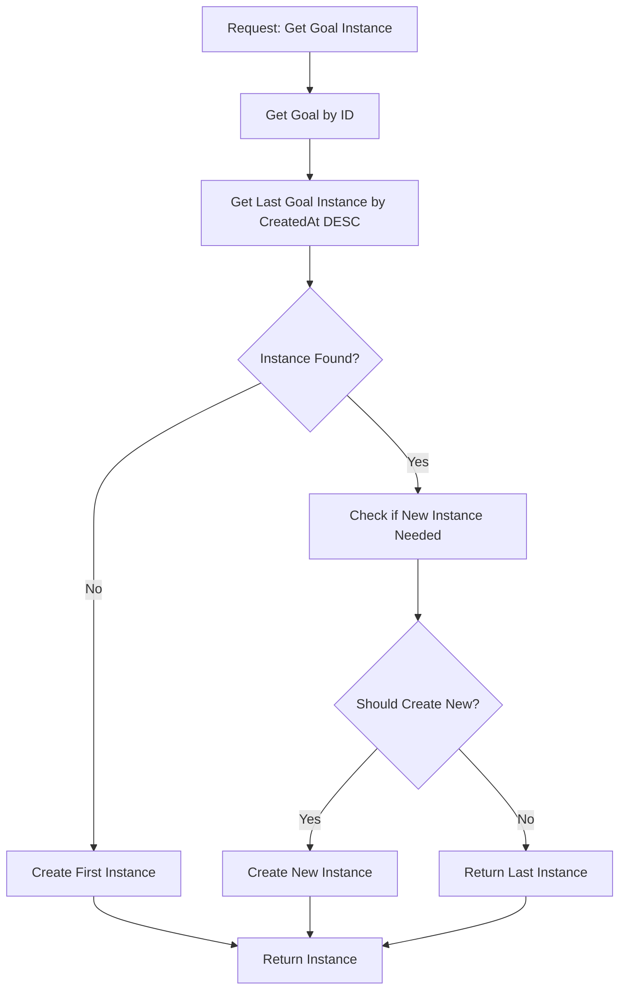
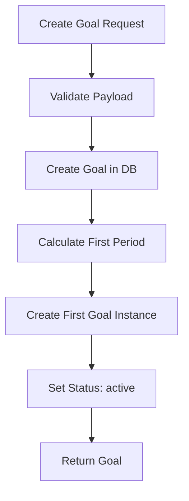
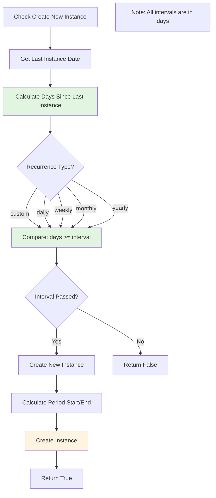
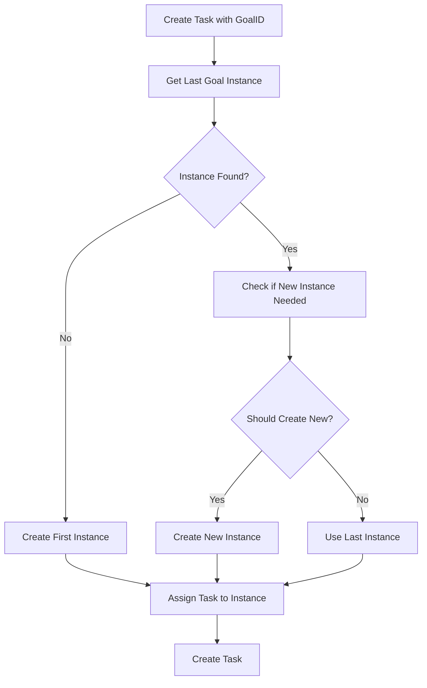
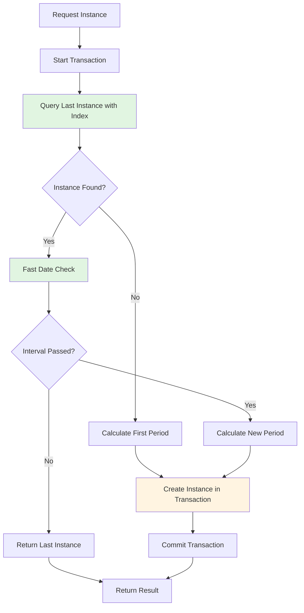

# Goal Instance Management Refactor

## Overview

Refactor the goal instance system to track instances by creation time rather than calculating current periods. The system will always work with the last created instance and only create new instances when recurrence intervals have passed.

## Current State Analysis

- **Goal Creation** ([backend/internal/handlers/goal/create_goal.go](backend/internal/handlers/goal/create_goal.go)): Creates first instance but uses incorrect period calculation
- **Get Current Instance** ([backend/internal/handlers/goal/get_current_goal_instance.go](backend/internal/handlers/goal/get_current_goal_instance.go)): Calculates period based on "now" instead of checking last instance
- **Task Creation** ([backend/internal/handlers/task/create_task.go](backend/internal/handlers/task/create_task.go)): Uses period calculation approach
- **Period Calculation** ([backend/internal/utils/calculate_goal_period.go](backend/internal/utils/calculate_goal_period.go)): Missing yearly type support

## Architecture Changes

### Core Flow




### Goal Creation Flow




### Instance Creation Check Flow




### Task Assignment Flow




### Optimized Instance Retrieval Flow




## Implementation Plan

### 1. Update Period Calculation Utility

**File**: [backend/internal/utils/calculate_goal_period.go](backend/internal/utils/calculate_goal_period.go)

- Add `calculateYearly()` function to handle yearly recurrence with leap year consideration
- Update `CalculateGoalPeriod()` to handle "yearly" type
- **Add timezone parameter**: Accept `*time.Location` parameter for timezone-aware calculations
- Update all calculation functions to use provided timezone:
- `startOfDay()` should use goal timezone, not server timezone
- All date operations should respect goal timezone
- **Note**: Period calculation may use different logic than interval checking
- Period calculation determines the period boundaries (start/end dates)
- Interval checking determines if enough days have passed (all intervals in days)
- These serve different purposes but should be consistent
- Both should use goal's timezone for consistency

### 2. Create Instance Check Function

**New File**: [backend/internal/handlers/goal/check_instance_creation.go](backend/internal/handlers/goal/check_instance_creation.go)Create `checkCreateNewGoalInstance()` function that:

- Takes goal and last instance as parameters
- **IMPORTANT**: All intervals are in days, regardless of recurrence type
- **Timezone-aware**: Uses goal's timezone for all date comparisons
- Implements logic for each recurrence type:
- **Custom**: Check if days since last instance >= interval (interval in days)
- **Daily**: Check if days since last instance >= interval (interval 1 = daily, interval 2 = every 2 days, etc.)
- **Weekly**: Check if days since last instance >= interval (interval 7 = weekly, interval 14 = bi-weekly, etc.)
- **Monthly**: Check if days since last instance >= interval (interval 30 = monthly, but months vary in length)
- **Yearly**: Check if days since last instance >= interval (interval 365 = yearly, but years vary in length)
- **Timezone handling**: 
- Get goal's timezone
- Convert current time to goal's timezone
- Convert last instance date to goal's timezone
- Perform day calculations in goal's timezone
- Returns boolean indicating if new instance should be created

### 3. Add Database Index for Performance

**File**: [backend/internal/db/models.go](backend/internal/db/models.go)Add index on `CreatedAt` for GoalInstance:

- Add `gorm:"index:idx_goal_created_at"` tag to `CreatedAt` field
- Create composite index `(goal_id, created_at)` for efficient last-instance queries
- This enables fast `ORDER BY created_at DESC LIMIT 1` queries

### 4. Create Helper Function for Last Instance

**File**: [backend/internal/handlers/goal/goal.go](backend/internal/handlers/goal/goal.go)Add `getLastGoalInstance(goalID string)` method to GoalHandler:

- Use `Select()` to only fetch needed fields: `ID`, `CreatedAt`, `PeriodStart`, `PeriodEnd`, `Status`
- Query with `Order("created_at DESC").Limit(1).First()` for optimal performance
- Use composite index `(goal_id, created_at)` for fast lookup
- Returns instance or nil if not found
- Handles the "impossible case" mentioned in notes (create first if none found)

### 5. Add Settings Model

**File**: [backend/internal/db/models.go](backend/internal/db/models.go)

- Create `Settings` struct with `Timezone` field
- Store IANA timezone name (e.g., "Europe/Amsterdam", "America/Chicago")
- Default timezone: `"UTC"`
- Singleton pattern: One settings record per application (or per user if multi-user)
- Add migration to create settings table and initialize default settings

### 6. Refactor Goal Creation

**File**: [backend/internal/handlers/goal/create_goal.go](backend/internal/handlers/goal/create_goal.go)

- Get user's current timezone from Settings
- Store timezone snapshot in Goal model (preserves timezone at creation time)
- Use database transaction to ensure atomicity of goal + instance creation
- Use `CalculateGoalPeriod()` utility with goal's timezone to properly calculate first period
- Set instance status to "active"
- Ensure period calculation works for all recurrence types with timezone awareness
- Batch goal and instance creation in single transaction to reduce round trips
- **Hybrid approach**: Existing goals keep their timezone, new goals use current user timezone

### 7. Refactor Get Current Goal Instance

**File**: [backend/internal/handlers/goal/get_current_goal_instance.go](backend/internal/handlers/goal/get_current_goal_instance.go)

- Use transaction with appropriate isolation level to prevent race conditions
- Change from period-based lookup to last-instance lookup
- Get last created instance using optimized query with index
- Only calculate period when actually creating new instance (lazy calculation)
- If none found, create first instance within transaction
- If found, check if new instance should be created (avoid period calculation if not needed)
- Return the appropriate instance (last or newly created)
- Use `Select()` to avoid loading unnecessary relations unless explicitly needed

### 8. Refactor Task Creation

**File**: [backend/internal/handlers/task/create_task.go](backend/internal/handlers/task/create_task.go)

- Use transaction to ensure task and instance creation are atomic
- Update `getOrCreateCurrentGoalInstance()` to use last-instance strategy
- Optimize goal lookup: fetch only needed fields (`RecurrenceType`, `RecurrenceInterval`, `RecurrenceAnchor`) using `Select()`
- Get last instance using optimized query instead of calculating current period
- Only calculate period when actually creating new instance
- Check if new instance needed before assigning task (early exit if not needed)
- Assign task to last (or newly created) instance
- Combine goal + instance queries where possible to reduce database round trips

### 9. Update Get Goal Instances

**File**: [backend/internal/handlers/goal/get_goal_instances.go](backend/internal/handlers/goal/get_goal_instances.go)

- Ensure ordering by `CreatedAt DESC` is explicit (uses index)
- Only preload `Tasks` when needed (consider making it optional via query param)
- Use pagination if returning many instances
- Consider adding a helper to get "current" instance (last created) for single-instance use cases

## Performance Optimizations

### Database Indexes

1. **Composite Index on GoalInstance**: `(goal_id, created_at DESC)`

- Enables fast "last instance" queries with `ORDER BY created_at DESC LIMIT 1`
- Single index covers both filtering and ordering

2. **Existing Indexes**: Leverage existing indexes on `goal_id` and `period_start`

### Query Optimizations

1. **Selective Field Loading**: Use `Select()` to fetch only needed fields

- Last instance check: Only `ID`, `CreatedAt`, `PeriodStart`, `PeriodEnd`, `Status`
- Goal lookup: Only `RecurrenceType`, `RecurrenceInterval`, `RecurrenceAnchor`
- Reduces memory usage and network transfer

2. **Lazy Period Calculation**: Only calculate periods when actually creating instances

- Check if new instance needed first (fast date comparison)
- Calculate period only if check passes

3. **Transaction Batching**: Use database transactions for atomic operations

- Goal + instance creation in single transaction
- Task + instance creation in single transaction
- Reduces round trips and ensures consistency

4. **Early Exit Strategies**: 

- Check recurrence type before expensive calculations
- Return early if interval hasn't passed
- Avoid unnecessary database writes

5. **Avoid N+1 Queries**: 

- Only preload relations when explicitly needed
- Use `Select()` to control which relations are loaded
- Consider making relation loading optional via query parameters

### Concurrency Handling

1. **Database Transactions**: Use appropriate isolation levels

- Prevent race conditions when creating instances
- Use `SELECT FOR UPDATE` or optimistic locking if needed

2. **Unique Constraints**: Leverage existing `idx_goal_period` unique index

- Prevents duplicate instances for same period
- Database-level protection against race conditions

## Technical Details

### Yearly Recurrence Calculation

For yearly recurrence, use `AddDate(years, 0, 0)` which automatically handles:

- Leap years (Feb 29)
- Variable year lengths
- Month-end dates (e.g., Jan 31 → Feb 28/29 in non-leap years)

### Date Comparison Strategy

- **All comparisons use goal's timezone**: Convert dates to goal timezone before comparison
- **Use IANA timezone names**: Always use names like `"America/Chicago"`, not `"CST"` (enables automatic DST handling)
- **Calendar days, not fixed hours**: Use `int(now.Sub(lastInstance).Hours() / 24)` for day calculations
- Works correctly across DST transitions (23/25 hour days)
- Avoid fixed 24-hour period checks which break during spring forward
- **Daily**: Compare `YYYY-MM-DD` strings in goal timezone or use `startOfDay()` in goal timezone
- `startOfDay()` automatically uses correct DST offset (CST vs CDT)
- **Weekly/Monthly/Yearly**: Use anchor-based calculation from `RecurrenceAnchor` in goal timezone
- **Custom**: Use days-based calculation from last instance's `PeriodStart` in goal timezone
- **Timezone conversion**: Always convert `time.Now()` to goal's timezone before operations using `.In(loc)`
- **DST handling**: Go's `time.Location` handles DST automatically - no manual DST code needed
- **Optimization**: Cache timezone location objects (`time.Location`), avoid repeated `LoadLocation()` calls

### Period Calculation vs Interval Checking

**Important Distinction**:

- **Interval Checking**: All intervals are in days. Simple calculation: `daysSince >= interval`
- **Period Calculation**: Uses `CalculateGoalPeriod()` utility to determine period boundaries (start/end dates) based on recurrence type and anchor
- These serve different purposes:
- Interval checking: "Has enough time passed?" (always in days)
- Period calculation: "What are the period boundaries?" (uses recurrence type logic)
- Instances should be created based on the last instance's date, not the current date
- Only calculate periods when actually creating new instances to avoid unnecessary computation

## Testing Considerations

### General Testing

- Test edge cases: month-end dates, leap years, timezone boundaries
- Test interval logic: ensure intervals are respected as days (e.g., bi-weekly = interval 14 days, not interval 2)
- Test all recurrence types with various interval values:
- Daily: interval 1, 2, 3 days
- Weekly: interval 7, 14, 21 days
- Monthly: interval 30, 60, 90 days
- Yearly: interval 365, 730 days
- Custom: any interval value
- Test concurrent requests: ensure no duplicate instances created
- Test "impossible case": goal with no instances (should create first)

### Timezone-Specific Testing

- **Cross-timezone goal creation**: Create goal in one timezone, verify timezone is stored correctly
- **User travel simulation**: 
- Create goal in timezone A (e.g., Europe/Amsterdam)
- Simulate user in timezone B (e.g., Asia/Tokyo)
- Verify goal behavior uses timezone A, not timezone B
- **Server timezone independence**: 
- Run server in different timezone than goal
- Verify goal behavior unaffected by server timezone
- **DST transitions**: 
- Test behavior during daylight saving time changes
- Verify "start of day" calculations handle DST correctly
- **Timezone edge cases**:
- Goals created at midnight in one timezone
- Date line crossings (e.g., goal in Pacific, user in Asia)
- Goals with UTC timezone vs local timezones
- **Backward compatibility**: 
- Existing goals without timezone field default to UTC
- Migration extracts timezone from RecurrenceAnchor if possible

## Timezone Handling Strategy

### Problem Scenario

**Example**: User creates a daily goal in Netherlands (NL, UTC+1), then travels to Chicago (UTC-6/-7) for a month while backend server is in US (UTC-5).**Issues without timezone handling**:

1. **Daily goals**: When does a "new day" start? Server time? User's current location? Original location?
2. **Date comparisons**: Interval checks use what timezone?
3. **Period calculations**: Start/end dates in which timezone?
4. **Inconsistent behavior**: Goal behavior changes based on user location or server location
5. **DST transitions**: How to handle daylight saving time changes?

### Solution: User Timezone Preference with Goal Snapshot (Hybrid Approach)

**Strategy**: Store user's timezone preference in Settings, snapshot it with each goal at creation time.**Key Principles**:

1. **User timezone preference**: Store user's current timezone in Settings model
2. **Snapshot on goal creation**: Store timezone with each goal (preserves timezone at creation)
3. **Hybrid behavior**: 

- Existing goals keep their original timezone (consistent behavior)
- New goals use current user timezone (adapts to user's location)

4. **Use goal timezone for all operations**: All date calculations use the goal's stored timezone
5. **DST handling**: Use IANA timezone names, Go's time package handles DST automatically
6. **Calendar days**: Use calendar days for intervals, not fixed 24-hour periods (handles DST correctly)

### Implementation Details

#### 1. Add Settings Model

**File**: [backend/internal/db/models.go](backend/internal/db/models.go)

```go
type Settings struct {
    ID       string    `json:"id" gorm:"primaryKey"`
    Timezone string    `json:"timezone" gorm:"not null;default:'UTC'"` // IANA timezone name
    CreatedAt time.Time `json:"createdAt"`
    UpdatedAt time.Time `json:"updatedAt"`
}
```


- Store IANA timezone name (e.g., "Europe/Amsterdam", "America/Chicago")
- Default: `"UTC"`
- Singleton: One settings record (or per-user if multi-user)

#### 2. Add Timezone Field to Goal Model

**File**: [backend/internal/db/models.go](backend/internal/db/models.go)

- Add `Timezone string` field to `Goal` struct
- Store IANA timezone name (snapshot of user timezone at creation)
- Default to UTC if not set
- This preserves the timezone used when goal was created

#### 3. Get User Timezone on Goal Creation

**File**: [backend/internal/handlers/goal/create_goal.go](backend/internal/handlers/goal/create_goal.go)

- Get user's current timezone from Settings
- Store timezone snapshot in Goal model
- Use this timezone for all goal calculations
- If Settings doesn't exist, default to UTC

#### 4. Timezone-Aware Date Operations with DST Handling

**New File**: [backend/internal/utils/timezone.go](backend/internal/utils/timezone.go)Create helper functions:

- `GetGoalLocation(goal db.Goal) (*time.Location, error)`: Get timezone location from goal (uses IANA names)
- `StartOfDayInTimezone(t time.Time, loc *time.Location) time.Time`: Get start of day in specific timezone (handles DST)
- `NowInTimezone(loc *time.Location) time.Time`: Get current time in specific timezone
- `DaysSinceInTimezone(t1, t2 time.Time, loc *time.Location) int`: Calculate calendar days between dates (DST-safe)

#### 5. Update Period Calculation with DST Handling

**File**: [backend/internal/utils/calculate_goal_period.go](backend/internal/utils/calculate_goal_period.go)

- Update `CalculateGoalPeriod()` to accept timezone parameter (`*time.Location`)
- Use goal's timezone for all date calculations
- Ensure `startOfDay()` uses goal timezone, not server timezone
- **Use calendar days, not fixed 24-hour periods** (critical for DST handling)
- Go's `time.Location` automatically handles DST transitions when using IANA names

#### 6. Update Instance Check Function with Calendar Day Calculations

**File**: [backend/internal/handlers/goal/check_instance_creation.go](backend/internal/handlers/goal/check_instance_creation.go)

- Load goal timezone when checking if new instance needed
- Convert "now" to goal's timezone before comparison
- **Calculate calendar days** since last instance (not hours/seconds)
- Use `DaysSinceInTimezone()` helper for DST-safe calculations
- Formula: `int(now.Sub(lastInstance).Hours() / 24)` works correctly across DST

#### 7. Update All Date Comparisons

All places that use `time.Now()` for goal operations should:

- Get goal's timezone using `GetGoalLocation()`
- Convert `time.Now()` to goal's timezone using `.In(loc)`
- Perform comparisons in goal's timezone
- Use calendar day calculations, not fixed time periods

### Timezone Flow Diagram

```mermaid
flowchart TD
    A[Goal Creation Request] --> B[Get User Timezone from Settings]
    B --> C{Settings Exist?}
    C -->|Yes| D[Get Current User Timezone]
    C -->|No| E[Default to UTC]
    E --> D
    D --> F[Store Timezone Snapshot in Goal]
    F --> G[Create Goal with Timezone]
    
    H[User Changes Timezone] --> I[Update Settings]
    I --> J{Existing Goals}
    J -->|Keep Original| K[Existing Goals Unchanged]
    J -->|Use New| L[Update All Goals - Not Recommended]
    
    M[Check if New Instance Needed] --> N[Get Goal's Timezone]
    N --> O[Convert Current Time to Goal Timezone]
    O --> P[Calculate Calendar Days Since Last Instance]
    P --> Q[Compare: days >= interval]
    Q --> R{Interval Passed?}
    
    S[Calculate Period] --> T[Get Goal Timezone]
    T --> U[Use IANA Timezone Name]
    U --> V[Go Handles DST Automatically]
    V --> W[Calculate Start/End in Goal Timezone]
    
    style B fill:#e1f5e1
    style N fill:#e1f5e1
    style T fill:#e1f5e1
    style V fill:#fff4e1
```




### Example Scenarios

#### Scenario 1: Daily Goal Created in NL, User Moves to Chicago

1. **Initial State (NL, UTC+1)**:

- User timezone in Settings: `"Europe/Amsterdam"`
- User creates daily goal "Exercise"
- Goal stored with `Timezone: "Europe/Amsterdam"` (snapshot)
- First instance: Jan 15, 00:00-23:59 Amsterdam time

2. **User Moves to Chicago (UTC-6/-7)**:

- User updates Settings: `Timezone = "America/Chicago"`
- Existing goal still has `Timezone: "Europe/Amsterdam"` (unchanged)
- User adds task at 2:00 PM Chicago time (9:00 PM Amsterdam time)
- System checks goal timezone: Amsterdam
- Current time in Amsterdam: 9:00 PM (Jan 15)
- Is it a new day? No (still Jan 15 in Amsterdam)
- Task added to Jan 15 instance

3. **Next Day in Chicago**:

- User adds task at 1:00 AM Chicago time (8:00 AM Amsterdam time, Jan 16)
- System checks: Current time in Amsterdam = Jan 16, 8:00 AM
- Is it a new day in Amsterdam? Yes (Jan 16)
- Check interval: Days since last instance >= 1? Yes
- Create new instance for Jan 16 (Amsterdam time)

4. **User Creates New Goal in Chicago**:

- New goal uses current user timezone: `"America/Chicago"`
- This goal uses Chicago timezone for all operations

#### Scenario 2: DST Spring Forward (Lose an Hour)

**Scenario**: Daily goal in Chicago, DST starts March 10, 2024 (2:00 AM → 3:00 AM)

1. **Before DST (March 9)**:

- Last instance: March 9, 00:00-23:59 CST (24 hours)

2. **During DST Transition (March 10, 2:00-3:00 AM)**:

- Hour 2:00-2:59 AM doesn't exist (skipped)
- Go's time package handles this automatically

3. **After DST (March 10)**:

- User adds task at 1:00 PM CDT (March 10)
- System: Current time in Chicago = March 10, 1:00 PM CDT
- Start of day calculation: March 10, 00:00:00 CDT (not CST)
- Go automatically uses CDT because DST is active
- Is it a new day? Yes (March 10)
- Create new instance: March 10, 00:00-23:59 CDT (23 hours, but still "one calendar day")

**Key**: Calendar days work correctly, even though the day is 23 hours long.

#### Scenario 3: DST Fall Back (Gain an Hour)

**Scenario**: Daily goal in Chicago, DST ends November 3, 2024 (2:00 AM → 1:00 AM)

1. **Before DST Ends (November 2)**:

- Last instance: November 2, 00:00-23:59 CDT

2. **During DST Transition (November 3, 1:00-2:00 AM)**:

- Hour 1:00-1:59 AM happens twice
- Go's `ParseInLocation` defaults to later occurrence (after DST ends, CST)

3. **After DST (November 3)**:

- User adds task at 1:30 AM
- System uses later occurrence: November 3, 1:30 AM CST
- Is it a new day? Yes (November 3)
- Create new instance: November 3, 00:00-23:59 CST (25 hours, but still "one calendar day")

**Key**: Calendar days work correctly, even though the day is 25 hours long.

### Database Schema Changes

**Migration 1: Create Settings Table**

- Create `settings` table
- Add `timezone` column (VARCHAR(50), default 'UTC')
- Initialize with default settings record

**Migration 2: Add Timezone to Goals**

- Add `timezone` column to `goals` table
- Type: `VARCHAR(50)` or `TEXT`
- Store IANA timezone name
- Default: `'UTC'` for existing goals
- Not null after migration
- Extract timezone from existing `RecurrenceAnchor` if possible

### API Considerations

**Frontend Changes**:

- Add timezone selector in settings UI
- Send timezone updates to backend Settings endpoint
- Frontend can auto-detect timezone: `Intl.DateTimeFormat().resolvedOptions().timeZone`
- Frontend already sends `RecurrenceAnchor` as ISO string with timezone (no changes needed)

**Backend API**:

- Add `GET /settings` endpoint to retrieve user timezone
- Add `PUT /settings` endpoint to update user timezone
- Goal creation automatically uses current user timezone from Settings

**Backward Compatibility**:

- Existing goals without timezone: Default to UTC
- Migration script: Extract timezone from existing `RecurrenceAnchor` if possible
- If `RecurrenceAnchor` has no timezone, default to UTC
- Settings table: Initialize with UTC if no record exists

### Testing Timezone Scenarios

1. **Cross-timezone goal creation**: Create goal in one timezone, verify timezone snapshot stored
2. **User timezone change**: 

- Create goal with timezone A
- Change user timezone to B
- Verify existing goal still uses timezone A
- Verify new goal uses timezone B

3. **Server timezone independence**: Run server in different timezone, verify goal behavior
4. **DST transitions**: 

- **Spring forward**: Test daily goal across March DST start (lose hour)
- **Fall back**: Test daily goal across November DST end (gain hour)
- Verify calendar day calculations work correctly (23/25 hour days)
- Verify interval calculations work across DST boundaries

5. **Edge cases**: 

- Midnight boundaries in different timezones
- Date line crossings
- Ambiguous times during fall back (1:00-1:59 AM happens twice)
- Non-existent times during spring forward (2:00-2:59 AM skipped)

6. **Interval calculations across DST**:

- Weekly goal (7 days) across DST transition
- Verify calendar days work, not fixed hours

### DST Handling Details

**Key Principles**:

1. **Use IANA Timezone Names**: Always use names like `"America/Chicago"`, not `"CST"` or fixed offsets

- Go's `time.LoadLocation()` automatically handles DST rules
- Knows when DST starts/ends for each timezone
- Handles historical DST changes

2. **Use Calendar Days, Not Fixed Hours**:

- ✅ Good: `daysSince := int(now.Sub(lastInstance).Hours() / 24)`
- ❌ Bad: `if now.Sub(lastInstance).Hours() >= 24` (breaks during spring forward)
- Calendar days work correctly even when days are 23 or 25 hours

3. **Let Go Handle DST Automatically**:

- `time.Date()` in a timezone automatically uses correct offset (CST vs CDT)
- `time.Now().In(loc)` automatically uses current DST status
- No manual DST calculations needed

4. **Handle Ambiguous Times**:

- During fall back, 1:00-1:59 AM happens twice
- Go's `ParseInLocation` defaults to later occurrence (after DST ends)
- For explicit control, use `time.Date()` which uses first occurrence if ambiguous

**Example DST-Safe Code**:

```go
// Get goal's timezone location (handles DST automatically)
loc, _ := time.LoadLocation(goal.Timezone) // "America/Chicago"

// Convert current time to goal timezone (uses correct DST offset)
nowInGoalTZ := time.Now().In(loc)

// Calculate start of day (automatically uses CST or CDT as appropriate)
startOfDay := time.Date(
    nowInGoalTZ.Year(), 
    nowInGoalTZ.Month(), 
    nowInGoalTZ.Day(), 
    0, 0, 0, 0, 
    loc, // Go knows if DST is active
)

// Calculate calendar days (works across DST transitions)
daysSince := int(nowInGoalTZ.Sub(lastInstance.In(loc)).Hours() / 24)
```


### Performance Considerations

- Timezone lookups: Cache `time.Location` objects to avoid repeated parsing
- Use `sync.Map` or similar to cache loaded locations
- IANA timezone loading is expensive, cache is critical
- Date conversions: Minimize timezone conversions (do once per operation)
- Index considerations: Timezone field doesn't need index (low cardinality)
- DST calculations: No performance impact - Go handles DST rules internally

## Notes

- **User Timezone Preference**: User can set and change their timezone in Settings
- **Goal Timezone Snapshot**: Each goal stores timezone at creation time (hybrid approach)