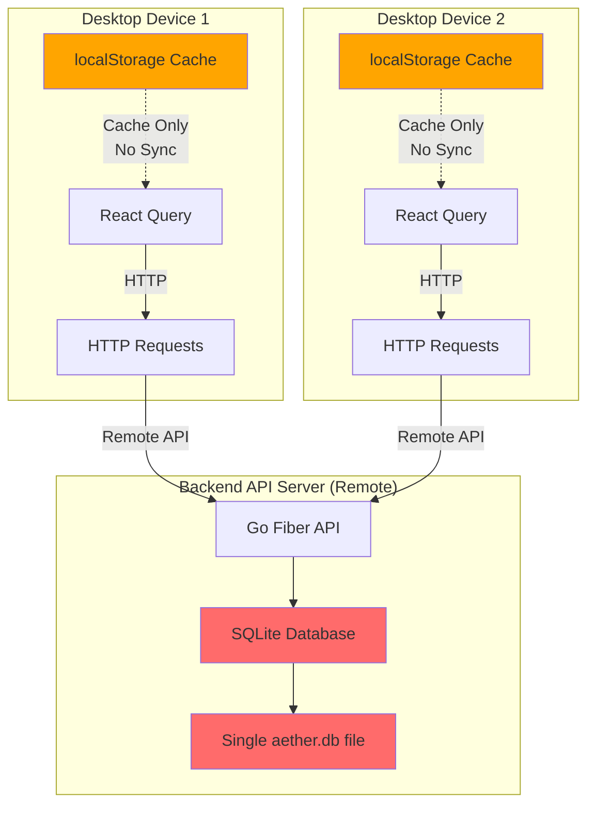

# Multi-Device Sync Issues Analysis

## Critical Issues

### 1. Database Choice: SQLite Limitations for Multi-Device

**Problem**: SQLite on the backend server is designed for single-device, local storage. While it can handle concurrent HTTP requests from multiple devices, it has significant limitations:

- **Write contention**: SQLite uses database-level locking, so concurrent writes from multiple devices will queue/serialize
- **No built-in replication**: Cannot sync data across multiple backend instances
- **Limited concurrent writes**: Performance degrades with many simultaneous write operations
- **No conflict resolution**: Last write wins without validation
- **No embedded replicas**: Desktop app can't have local database that syncs

**Location**: `backend/internal/db/db.go` - Uses SQLite with connection pooling (MaxOpenConns: 100), but SQLite's write lock means only one write at a time.**Impact**:

- Multiple desktop devices writing simultaneously will experience slowdowns
- No way to handle write conflicts intelligently
- Database becomes a bottleneck as device count grows
- Cannot scale horizontally (multiple backend instances)
- Desktop app must be online to access data (no local-first architecture)

**Potential Solution**: Migrate to libSQL (Turso) which provides:

- Built-in replication and sync
- Embedded replicas for offline support
- Better concurrent write handling
- SQLite compatibility (minimal code changes)

### 2. No Conflict Resolution Mechanism

**Problem**: Update handlers (`backend/internal/handlers/entry/update_entry.go`, `backend/internal/handlers/task/update_task.go`) simply overwrite data without checking:

- If the record was modified on another device
- Timestamp comparison (last-write-wins without validation)
- Version numbers or optimistic locking

**Impact**:

- Last write wins, causing data loss
- No way to detect or resolve conflicts
- Silent data overwrites

### 3. Missing Sync Metadata

**Problem**: Models (`backend/internal/db/models.go`) lack fields needed for sync:

- No `LastSyncedAt` timestamp
- No `DeviceID` to track which device made changes
- No `Version` or `SyncVersion` for conflict detection
- No `IsDirty` flag to mark unsynced changes
- No `SyncStatus` field

**Impact**:

- Cannot determine which records need syncing
- Cannot track sync state per device
- No way to implement incremental sync

### 4. Generated SDK Has Hardcoded URLs

**Problem**: Desktop SDK (`desktop/src/aether-sdk/index.ts`) is generated with hardcoded `http://127.0.0.1:9119` URLs. While `orval.config.ts` supports `API_URL` env variable, the SDK needs regeneration after changing it.**Impact**:

- SDK must be regenerated when API URL changes
- Hardcoded URLs in generated code make it less flexible
- Runtime configuration not possible without regeneration

### 5. React Query is Caching, Not Syncing

**Problem**: Desktop app (`desktop/src/utils/query-client.ts`) uses React Query with localStorage persistence, but this is just caching, NOT real synchronization:

- React Query caches API responses locally
- No mechanism to detect when data changed on another device
- No background sync or polling
- Cache can become stale if another device modifies data

**Impact**:

- Data can become stale across devices
- No automatic refresh when other devices make changes
- User must manually refresh to see updates from other devices
- No real-time or near-real-time sync

### 6. No Offline Queue System

**Problem**: No mechanism to:

- Queue mutations when offline
- Retry failed syncs
- Track pending operations
- Handle network failures gracefully

**Impact**:

- Changes made offline are lost if app closes
- No retry mechanism for failed API calls
- No way to sync when connection restored

### 7. No Device Identification

**Problem**: No way to:

- Identify which device made changes
- Track device-specific sync state
- Handle device-specific conflicts

**Impact**:

- Cannot implement per-device sync
- Cannot track which device last modified a record
- No device-specific conflict resolution

### 8. No Authentication/Authorization

**Problem**:

- CORS allows all origins (`backend/internal/api/api.go`: `AllowOrigins: "*"`)
- No user authentication
- No device registration
- No access control

**Impact**:

- Any device can access/modify any data
- No user isolation
- Security vulnerability
- Cannot implement multi-user support

### 9. No Sync Endpoints

**Problem**: API lacks endpoints for:

- Getting changes since last sync timestamp
- Bulk sync operations
- Conflict resolution
- Sync status/health checks

**Impact**:

- Must fetch all data on every sync (inefficient)
- No incremental sync possible
- No way to resolve conflicts server-side

### 10. Timestamp Issues

**Problem**:

- `UpdatedAt` is auto-managed by GORM but not used for conflict detection
- No comparison of timestamps before updates
- Clock skew between devices not handled
- No vector clocks or logical timestamps

**Impact**:

- Cannot reliably determine which change is newer
- Clock differences cause incorrect conflict resolution
- No way to order events across devices

### 11. No Transaction Logging

**Problem**: No audit trail of:

- What changes were made
- When changes occurred
- Which device made changes
- Operation history

**Impact**:

- Cannot replay changes for sync
- No way to recover from sync failures
- No debugging capability for sync issues

### 12. React Query Configuration Issues

**Problem**: Desktop app (`desktop/src/utils/query-client.ts`):

- `retry: false` - no retry on failure
- Only persists successful queries to localStorage
- No offline mutation queue
- No sync mechanism

**Impact**:

- Failed requests are not retried
- Offline changes not persisted properly
- No background sync

## Architecture Diagram




## Recommended Solutions

### Option 1: Migrate to libSQL (Recommended)

**Why libSQL is a great fit:**

- ✅ **SQLite-compatible**: Minimal code changes (just swap the driver)
- ✅ **Built-in replication**: Automatic sync between backend and desktop replicas
- ✅ **Offline-first**: Desktop can use embedded libSQL replica that syncs when online
- ✅ **Better concurrency**: Handles concurrent writes better than SQLite
- ✅ **Remote access**: HTTP/WebSocket support for API access
- ✅ **Local-first architecture**: Desktop has local DB, syncs in background

**Architecture with libSQL:**

```javascript
Backend Server → libSQL server (Turso cloud or self-hosted)
Desktop App → Embedded libSQL replica → Syncs with backend
```

**What you still need:**

- Conflict resolution strategy (libSQL syncs but doesn't resolve conflicts automatically)
- Sync metadata fields (Version, DeviceID) for conflict detection
- Device identification

**Migration effort**: Low-Medium (driver change + replica setup)

### Option 2: Keep SQLite + Add Sync Layer

**Short-term (Quick Fixes)**

1. Add sync metadata fields to all models
2. Implement timestamp-based conflict detection
3. Add device identification
4. Make API URLs configurable
5. Add basic authentication

**Medium-term (Architecture Changes)**

1. Implement incremental sync endpoints
2. Add offline queue system for desktop app
3. Add background sync/polling mechanism
4. Add conflict resolution strategy
5. Consider PostgreSQL for better concurrency

### Option 3: Complete Redesign

1. Implement CRDTs (Conflict-free Replicated Data Types)
2. Use a proper sync framework (like Firebase, Supabase, or custom)
3. Add vector clocks for event ordering
4. Implement proper multi-master replication
5. Add comprehensive sync testing

## Files Requiring Changes

- `backend/internal/db/models.go` - Add sync metadata (Version, LastSyncedAt, DeviceID)