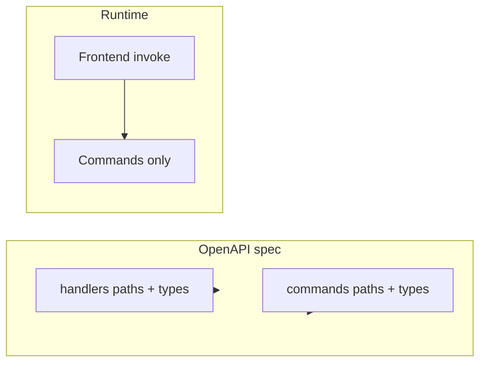

# Remove handlers and rely on Tauri commands

## Current state

Handlers are used only for: (1) OpenAPI `paths()` and `components(schemas)` in [desktop/src-tauri/src/api/openapi.rs](desktop/src-tauri/src/api/openapi.rs), and (2) shared types that commands import. No HTTP server runs; the frontend calls Tauri commands via a custom mutator that maps REST-style operations to command names.

## 1. Preserve shared types under `api` (not handlers)

- Add [desktop/src-tauri/src/api/common.rs](desktop/src-tauri/src/api/common.rs) with the **exact contents** of [desktop/src-tauri/src/handlers/common.rs](desktop/src-tauri/src/handlers/common.rs): `PaginationResponse<T>`, its `#[aliases(...)]`, the `impl` block, and the `cursor` submodule (encode/decode/composite).
- In [desktop/src-tauri/src/api/mod.rs](desktop/src-tauri/src/api/mod.rs), add `pub mod common;` and re-export if desired.
- Update [desktop/src-tauri/src/api/openapi.rs](desktop/src-tauri/src/api/openapi.rs) to use `crate::api::common::*` instead of `crate::handlers::common::*`.

## 2. Move request/response types from handlers into commands

Types that currently live in handlers and are referenced in OpenAPI or by commands must be defined in the corresponding command module (so OpenAPI can reference `commands::*`). Add or move structs as follows:

| From handler module | Types to move                                                                                                                              | Target command module                                              |
| ------------------- | ------------------------------------------------------------------------------------------------------------------------------------------ | ------------------------------------------------------------------ |
| entry               | `CreateEntryRequest`, `UpdateEntryRequest`                                                                                                 | [commands/entry.rs](desktop/src-tauri/src/commands/entry.rs)       |
| task                | `CreateTaskRequest`, `UpdateTaskRequest`, `CreateSubTaskRequest`, `UpdateSubTaskRequest`, `ReorderSubTasksRequest`, `AddGoalToTaskRequest` | [commands/task.rs](desktop/src-tauri/src/commands/task.rs)         |
| goal                | `CreateGoalRequest`, `UpdateGoalRequest`                                                                                                   | [commands/goal.rs](desktop/src-tauri/src/commands/goal.rs)         |
| tag                 | `CreateTagRequest`                                                                                                                         | [commands/tag.rs](desktop/src-tauri/src/commands/tag.rs)           |
| bookmark            | `CreateBookmarkRequest`, `UpdateBookmarkRequest`                                                                                           | [commands/bookmark.rs](desktop/src-tauri/src/commands/bookmark.rs) |
| search              | `SearchRequest`, `SearchResponse`, `SearchResultResponse`                                                                                  | [commands/search.rs](desktop/src-tauri/src/commands/search.rs)     |
| settings            | `GetSettingQuery` (if used in schema), `SettingResponse`, `AllSettingsResponse`, `SetSettingRequest`                                       | [commands/settings.rs](desktop/src-tauri/src/commands/settings.rs) |

For **settings**: `AllSettingsResponse` has a custom `ToSchema` impl and `From`/`Into` for `HashMap<String, String>`; move those as well. For **search**: OpenAPI comment says `SearchResultResponse` is not in components due to `serde(flatten)`; keep it in commands/search for the command return type only.

Copy the struct definitions (and derives, doc comments) from the handler files into the command files; then remove the handler-side imports from those command files so they use the local types.

## 3. Point OpenAPI at commands only

In [desktop/src-tauri/src/api/openapi.rs](desktop/src-tauri/src/api/openapi.rs):

- **paths**: Replace every handler reference with the corresponding command. Use `commands::entry`, `commands::tag`, `commands::task`, `commands::goal`, `commands::trash`, `commands::activity`, `commands::search`, `commands::settings` for the operations that are currently `entry::*`, `tag::*`, `task_handlers::*`, `goal_handlers::*`, `trash_handlers::*`, `activity_handlers::*`, `search_handlers::*`, `settings_handlers::*`. The link, audio, transcription, sync, bookmark, canvas paths already use `*_commands`; leave those as-is.
- **components(schemas)**: Replace handler type references with command type references: `entry::*` → `commands::entry::*`, `tag::*` → `commands::tag::*`, `task_handlers::*` → `commands::task::*`, `goal_handlers::*` → `commands::goal::*`, `search_handlers::*` → `commands::search::*`, `settings_handlers::*` → `commands::settings::*`, `crate::handlers::bookmark::*` → `commands::bookmark::*`. Keep pagination and other aliases from `api::common`.
- Remove all `use crate::handlers::*` and use only `crate::commands::*` and `crate::api::common::*`.

## 4. Update all imports of handlers across the crate

- **Commands** (entry, task, goal, tag, bookmark, settings, search, transcription, link, canvas): change `use crate::handlers::common::PaginationResponse` to `use crate::api::common::PaginationResponse`. Remove any `use crate::handlers::<module>::*` now that types live in the same command module or in api/common.
- **Bookmark command**: also change `Result<crate::handlers::common::PaginationResponse<Bookmark>>` and `PaginationResponse::new(...)` to use `crate::api::common::PaginationResponse`.
- **Repositories** ([task](desktop/src-tauri/src/db/repositories/task.rs), [entry](desktop/src-tauri/src/db/repositories/entry.rs), [goal](desktop/src-tauri/src/db/repositories/goal.rs), [transcription](desktop/src-tauri/src/db/repositories/transcription.rs), [canvas](desktop/src-tauri/src/db/repositories/canvas.rs), [tag](desktop/src-tauri/src/db/repositories/tag.rs), [link](desktop/src-tauri/src/db/repositories/link.rs), [bookmark](desktop/src-tauri/src/db/repositories/bookmark.rs)): change `use crate::handlers::common::cursor` to `use crate::api::common::cursor`.

## 5. Remove the handlers module and axum

- Delete the handler source files: [desktop/src-tauri/src/handlers/entry.rs](desktop/src-tauri/src/handlers/entry.rs), task.rs, goal.rs, tag.rs, trash.rs, activity.rs, search.rs, settings.rs, bookmark.rs, common.rs, and [desktop/src-tauri/src/handlers/mod.rs](desktop/src-tauri/src/handlers/mod.rs).
- In [desktop/src-tauri/src/lib.rs](desktop/src-tauri/src/lib.rs), remove `pub mod handlers;`.
- In [desktop/src-tauri/Cargo.toml](desktop/src-tauri/Cargo.toml), remove the axum dependency (the comment says it was only for handler types used in OpenAPI).
- In [desktop/src-tauri/build.rs](desktop/src-tauri/build.rs), remove the line `println!("cargo:rerun-if-changed=src/handlers");` (and optionally add `src/api/common.rs` if you want the spec to rebuild when common changes).

## 6. Regenerate spec and SDK

- From the `desktop` directory (or as in [desktop/prod-build.sh](desktop/prod-build.sh)): `cargo run --bin generate-openapi -p generate-openapi-tool` to write `desktop/src/openapi/spec.json` (or the path the tool uses).
- Run `npm run generate:sdk` (or `orval --config ./orval.config.ts`) to regenerate the TypeScript client from the new spec.

## Verification

- `cargo build` in `desktop/src-tauri` succeeds.
- OpenAPI generation runs without panic; generated `spec.json` still contains the same operation IDs/paths so the existing [api-client.ts](desktop/src/lib/api-client.ts) route-to-command mapping remains valid.
- Optionally run the full app and smoke-test a few flows (e.g. entries, tasks, settings) to confirm the frontend still receives correct responses.

## Files touched (summary)

- **New**: `api/common.rs` (content from handlers/common.rs).
- **Modified**: `api/mod.rs`, `api/openapi.rs`; `commands/entry.rs`, `commands/task.rs`, `commands/goal.rs`, `commands/tag.rs`, `commands/bookmark.rs`, `commands/search.rs`, `commands/settings.rs` (add types, fix imports); `db/repositories/*.rs` (cursor import); `lib.rs`, `Cargo.toml`, `build.rs`.
- **Deleted**: `handlers/*.rs` and `handlers/mod.rs`.

