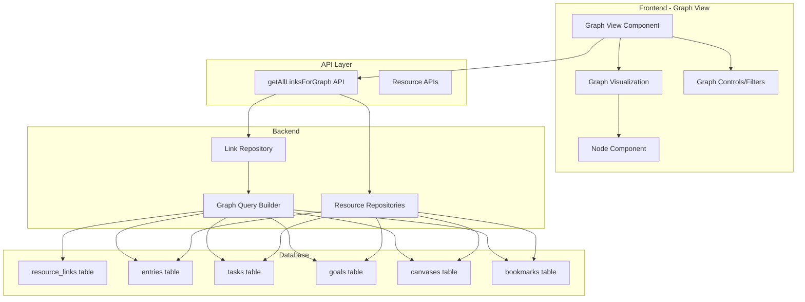

# Resource Linking System Implementation

## Overview

This plan implements a bidirectional linking system similar to Obsidian's `[[]]` syntax, allowing users to create links between all resource types (journal entries, tasks, goals, canvas nodes, bookmarks) with autocomplete search, backlink visualization, and an interactive knowledge graph to visualize all connections.

## Architecture

### Database Schema

Create a new migration file `009_add_resource_links.sql`:

- **`resource_links` table**: Stores bidirectional links between resources
  - `id` (TEXT PRIMARY KEY)
  - `source_type` (TEXT) - entry, task, goal, canvas, bookmark
  - `source_id` (TEXT) - ID of the source resource
  - `target_type` (TEXT) - entry, task, goal, canvas, bookmark
  - `target_id` (TEXT) - ID of the target resource
  - `link_text` (TEXT) - Optional display text for the link
  - `created_at` (TEXT)
  - Indexes on `(source_type, source_id)` and `(target_type, target_id)` for efficient backlink queries

### Backend Implementation

#### 1. Database Models (`desktop/src-tauri/src/db/models.rs`)

Add `ResourceLink` model:

```rust
pub struct ResourceLink {
    pub id: String,
    pub source_type: String,
    pub source_id: String,
    pub target_type: String,
    pub target_id: String,
    pub link_text: Option<String>,
    pub created_at: DateTime<Utc>,
}
```

#### 2. Link Repository (`desktop/src-tauri/src/db/repositories/link.rs`)

Create repository with methods:

- `create()` - Create a new link
- `find_by_source()` - Get all links from a source resource
- `find_by_target()` - Get all backlinks to a target resource
- `delete()` - Remove a link
- `delete_by_source()` - Remove all links from a source (when resource is deleted)
- `extract_links_from_content()` - Parse content to extract `[[]]` links

#### 3. Link Parser (`desktop/src-tauri/src/utils/link_parser.rs`)

Utility to:

- Parse Lexical JSON content to extract text
- Find `[[]]` patterns in text
- Match link text to resources using search/fuzzy matching
- Return structured link data

#### 4. Tauri Commands (`desktop/src-tauri/src/commands/link.rs`)

Commands:

- `create_link()` - Create a link between resources
- `get_backlinks()` - Get all resources linking to a target
- `get_outgoing_links()` - Get all links from a source
- `delete_link()` - Remove a link
- `search_linkable_resources()` - Search for resources to link (for autocomplete)
- `get_all_links_for_graph()` - Get all links with resource metadata for graph visualization

#### 5. Update Resource Handlers

Modify handlers to:

- Extract and sync links when content is saved (entries, tasks, goals, canvas, bookmarks)
- Delete links when resources are deleted
- Include link counts in resource queries

### Frontend Implementation

#### 1. Link Node for Lexical (`desktop/src/components/editor/plugins/resource-link-plugin/`)

Create new Lexical node and plugin:

- `ResourceLinkNode` - Custom Lexical node for `[[]]` links
- `ResourceLinkPlugin` - Plugin that:
  - Detects `[[` trigger
  - Shows autocomplete/search dropdown
  - Creates `ResourceLinkNode` when link is selected
  - Renders links with proper styling

#### 2. Autocomplete Component (`desktop/src/components/editor/plugins/resource-link-plugin/resource-link-autocomplete.tsx`)

- Typeahead menu similar to slash commands
- Searches across all resource types
- Shows resource type icon, name/title, and preview
- Filters results as user types

#### 3. Link Rendering (`desktop/src/components/shared/resource-link.tsx`)

Component that:

- Renders clickable link with resource name/title
- Shows resource type badge/icon
- Handles navigation to linked resource
- Opens backlink popover on click

#### 4. Backlink Popover (`desktop/src/components/shared/backlinks-popover.tsx`)

Popover component that:

- Fetches backlinks for a resource
- Displays list of resources linking to current resource
- Shows preview/snippet of link context
- Allows navigation to linking resources

#### 5. Integration Points

Update resource views to:

- **Journal Editor**: Add `ResourceLinkPlugin` to editor config
- **Task Description**: Support links in task description editor
- **Goal Description**: Support links in goal description editor
- **Canvas**: Parse canvas JSON for link nodes, support linking in canvas text nodes
- **Bookmarks**: Support links in bookmark notes/description (if applicable)

#### 6. API Client (`desktop/src/lib/api-client.ts`)

Add methods:

- `createLink()`
- `getBacklinks()`
- `getOutgoingLinks()`
- `deleteLink()`
- `searchLinkableResources()`
- `getAllLinksForGraph()`

#### 7. Knowledge Graph View (`desktop/src/features/graph/graph.view.tsx`)

Create interactive knowledge graph visualization:

- **Graph Component**: Use `react-force-graph` or `vis-network` for rendering
- **Nodes**: Represent resources (entries, tasks, goals, canvas, bookmarks)
  - Color-coded by resource type
  - Sized by link count (more links = larger node)
  - Show resource name/title on hover or click
- **Edges**: Represent links between resources
  - Directional arrows showing link direction
  - Optional edge labels showing link count
- **Interactions**:
  - Click node to navigate to resource
  - Hover to show resource preview
  - Drag nodes to rearrange layout
  - Zoom and pan controls
- **Filters**:
  - Filter by resource type
  - Filter by link count (show only highly connected nodes)
  - Search/focus on specific resource
- **Layout Options**:
  - Force-directed layout (default)
  - Hierarchical layout
  - Circular layout
  - Manual positioning (save positions)

## Implementation Details

### Link Syntax Parsing

The `[[]]` syntax will be parsed as:

- `[[resource-name]]` - Fuzzy match by name/title
- `[[resource-type:resource-id]]` - Explicit ID (for programmatic links)
- Links are extracted from Lexical JSON by:

  1. Converting Lexical state to plain text
  2. Finding `[[...]]` patterns
  3. Matching to resources via search API
  4. Creating `ResourceLinkNode` instances

### Link Storage

Links are stored in two ways:

1. **In content**: As `ResourceLinkNode` in Lexical JSON (for rendering)
2. **In database**: As `resource_links` table rows (for queries and backlinks)

When content is saved:

- Extract all `ResourceLinkNode` instances
- Sync with database (create new, delete removed, update changed)

### Backlink Queries

Backlinks are queried efficiently using:

```sql
SELECT * FROM resource_links 
WHERE target_type = ? AND target_id = ?
```

### Resource Identification

Each resource type has:

- **Entry**: Use entry ID, display first line of content or "Untitled Entry"
- **Task**: Use task ID, display task title
- **Goal**: Use goal ID, display goal name
- **Canvas**: Use canvas ID, display canvas name
- **Bookmark**: Use bookmark ID, display bookmark title or URL

## Files to Create/Modify

### New Files

- `desktop/src-tauri/migrations/009_add_resource_links.sql`
- `desktop/src-tauri/src/db/repositories/link.rs`
- `desktop/src-tauri/src/utils/link_parser.rs`
- `desktop/src-tauri/src/commands/link.rs`
- `desktop/src/components/editor/plugins/resource-link-plugin/resource-link-node.tsx`
- `desktop/src/components/editor/plugins/resource-link-plugin/resource-link-plugin.tsx`
- `desktop/src/components/editor/plugins/resource-link-plugin/resource-link-autocomplete.tsx`
- `desktop/src/components/shared/resource-link.tsx`
- `desktop/src/components/shared/backlinks-popover.tsx`
- `desktop/src/features/graph/graph.view.tsx`
- `desktop/src/features/graph/components/graph-visualization.tsx`
- `desktop/src/features/graph/components/graph-controls.tsx`
- `desktop/src/features/graph/components/graph-node.tsx`
- `desktop/src/features/graph/hooks/use-graph-data.ts`

### Modified Files

- `desktop/src-tauri/src/db/models.rs` - Add `ResourceLink` model
- `desktop/src-tauri/src/db/repositories/mod.rs` - Export link repository
- `desktop/src-tauri/src/db/schema.rs` - Add link table creation
- `desktop/src-tauri/src/lib.rs` - Register link commands
- `desktop/src-tauri/src/handlers/entry.rs` - Sync links on save
- `desktop/src-tauri/src/handlers/task.rs` - Sync links on save
- `desktop/src-tauri/src/handlers/goal.rs` - Sync links on save
- `desktop/src-tauri/src/handlers/canvas.rs` - Sync links on save
- `desktop/src-tauri/src/handlers/bookmark.rs` - Sync links on save
- `desktop/src/components/editor/editor.tsx` - Add `ResourceLinkPlugin`
- `desktop/src/features/journal/components/journal-editor.tsx` - Ensure plugin is active
- `desktop/src/features/tasks/components/task-item/task-item-description.tsx` - Add link support
- `desktop/src/lib/api-client.ts` - Add link API methods
- `desktop/src/features/router.tsx` - Add graph view route
- `desktop/src/components/shared/navigation-control.tsx` - Add graph navigation item

## Testing Considerations

- Test link creation from all resource types
- Test backlink queries return correct results
- Test link deletion when resources are deleted
- Test autocomplete search accuracy
- Test link rendering in all contexts
- Test bidirectional link integrity

## Knowledge Graph Implementation Details

### Architecture Diagram



### Graph Library Choice

**Recommended: `react-force-graph`**

- Lightweight and performant
- Built-in force-directed layout
- Good for interactive graphs
- Easy to customize node/edge rendering

**Alternative: `vis-network`**

- More features (hierarchical layouts, clustering)
- Heavier bundle size
- More configuration options

**Installation:**

```bash
npm install react-force-graph
# or
npm install vis-network react-vis-network
```

### Graph Data Structure

```typescript
interface GraphNode {
  id: string
  type: 'entry' | 'task' | 'goal' | 'canvas' | 'bookmark'
  label: string // Resource name/title
  linkCount: number // Number of connections
  metadata: {
    // Resource-specific data for previews
  }
}

interface GraphEdge {
  source: string // Node ID
  target: string // Node ID
  count: number // Number of links between these resources
}
```

### Backend Graph Query

The `get_all_links_for_graph()` command should:

1. Fetch all links from `resource_links` table
2. Join with resource tables to get metadata (name, title, etc.)
3. Aggregate links to count connections between resources
4. Return nodes and edges with full metadata
```sql
-- Example query structure
SELECT 
  rl.source_type, rl.source_id, rl.target_type, rl.target_id,
  -- Join with resource tables to get names/titles
  source_entry.document as source_entry_title,
  target_task.title as target_task_title,
  -- etc.
FROM resource_links rl
LEFT JOIN entries source_entry ON rl.source_type = 'entry' AND rl.source_id = source_entry.id
LEFT JOIN tasks target_task ON rl.target_type = 'task' AND rl.target_id = target_task.id
-- ... more joins for each resource type
WHERE rl.source_id IS NOT NULL AND rl.target_id IS NOT NULL
```


### Graph Features

1. **Node Styling**:

   - Different colors for each resource type
   - Size based on connection count (logarithmic scale)
   - Icons for resource types

2. **Layout Algorithms**:

   - Force-directed (default) - natural clustering
   - Hierarchical - tree-like structure
   - Circular - nodes in a circle
   - Grid - organized grid layout

3. **Interactions**:

   - Click node → Navigate to resource
   - Hover node → Show resource preview tooltip
   - Drag node → Reposition manually
   - Click edge → Show link details
   - Double-click node → Focus/expand neighborhood

4. **Filters & Controls**:

   - Resource type filter (show/hide types)
   - Minimum link count filter
   - Search to highlight specific resources
   - Toggle edge labels
   - Reset layout button
   - Export graph as image

5. **Performance**:

   - Virtual rendering for large graphs (1000+ nodes)
   - Debounced layout calculations
   - Progressive loading (load nodes in batches)

## Future Enhancements

- Link preview on hover
- Link suggestions based on content similarity
- Link aliases/display names
- Link context snippets in backlinks
- Graph clustering algorithms
- Graph export/import
- Graph analytics (centrality, communities)
- Time-based graph (show links created in date range)