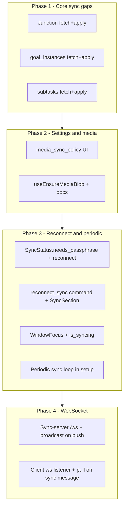

# Sync Completion Plan

## 1. Junction tables and missing entities (push + apply)

Seven entities are queued to `_sync_outbox` by triggers but are **not pushed** (`fetch_row_json` returns `None`) and **not applied** into real tables (they go to `store_unknown` → `_sync_unknown`):

- **Junctions:** `entry_tags`, `task_tags`, `goal_tags`, `goal_instance_tags`, `bookmark_tags`
- **Entities:** `goal_instances`, `subtasks`

### 1.1 Push: add `fetch_*_row` and `fetch_row_json` branches

In [desktop/src-tauri/src/sync/push.rs](desktop/src-tauri/src/sync/push.rs):

- **Junction fetchers** (same pattern for all five). Example `fetch_entry_tags_row`:
  - `SELECT entry_id, tag_id, _sync_id, _updated_at, _deleted, _extra FROM entry_tags WHERE _sync_id = ?1`
  - Build JSON: `entry_id`, `tag_id`, `_sync_id`, `_updated_at`, `_deleted`, `_extra`. `entity_id` is `entry_id||'|'||tag_id` (or `_sync_id`).
- **goal_instances:** `SELECT id, goal_id, period_start, period_end, status, created_at, updated_at, deleted_at, _sync_id, _updated_at, _deleted, _extra`  
  - `updated_at` exists (migration 002). Use same column order as in [db/repositories](desktop/src-tauri/src/db/repositories/goal.rs) goal_instance queries.
- **subtasks:** `SELECT id, title, is_completed, task_id, order_index, created_at, updated_at, deleted_at, _sync_id, _updated_at, _deleted, _extra`

Add all seven to the `fetch_row_json` `match` (around line 145).

### 1.2 Apply: add `apply_*_upsert` and `apply_upsert` branches

In [desktop/src-tauri/src/sync/apply.rs](desktop/src-tauri/src/sync/apply.rs):

- **Junction upserts** — `INSERT OR REPLACE` into the real table. For `entry_tags`:
  - Columns: `entry_id`, `tag_id`, `_sync_id`, `_updated_at`, `_deleted`, `_extra`
  - `entity_id` = `entry_id|tag_id`; parse from `data` or derive from `entity_id` for `entry_id`/`tag_id`.
- **goal_instances:**  
  - `INSERT OR REPLACE INTO goal_instances (id, goal_id, period_start, period_end, status, created_at, updated_at, deleted_at, _sync_id, _updated_at, _deleted, _extra)`
- **subtasks:**  
  - `INSERT OR REPLACE INTO subtasks (id, title, is_completed, task_id, order_index, created_at, updated_at, deleted_at, _sync_id, _updated_at, _deleted, _extra)`

Add the seven corresponding branches in the `apply_upsert` `match` (around line 112). Soft deletes for these tables already work via `entity_to_table` in `apply_soft_delete`.

---

## 2. Frontend: `sync.media_sync_policy` UI

### 2.1 Hook and setting

In [desktop/src/hooks/use-sync.ts](desktop/src/hooks/use-sync.ts):

- `get_setting("sync.media_sync_policy")` in the same `useQuery` as sync status (or a separate query). Default `"on_demand"` when unset.
- `setMediaSyncPolicy(value: "auto" | "on_demand")` that calls `set_setting("sync.media_sync_policy", value)` and invalidates `["sync", "status"]` (or a `["sync","media_policy"]` key).

### 2.2 Sync section UI

In [desktop/src/features/settings/components/sync.section.tsx](desktop/src/features/settings/components/sync.section.tsx):

- Add a control (select or radio): **"Auto sync media"** (`auto`) vs **"Download as needed"** (`on_demand`), with short labels matching [SYNC.md](SYNC.md).
- Bind to `mediaSyncPolicy` from `useSync` and `setMediaSyncPolicy`. Show only when `status?.connected` (or always; if not connected, the setting is still persisted for next time).

---

## 3. `ensure_media_blob` for images and video

### 3.1 Backend

- **Tauri command** `ensure_media_blob(mediaId)` already exists and is registered.

### 3.2 Frontend hook

- Add `useEnsureMediaBlob(mediaId: string | null)` that:
  - Calls `invoke("ensure_media_blob", { mediaId })` when `mediaId` is non-null and the component cares about loading that blob (e.g. before resolving a URL for an image/video). Fire-and-forget or track loading/error as needed.
- Use it in any component that resolves a `media_items` row for **image** or **video** before reading the file or building a `file://`/blob URL. Today only **audio** goes through `get_audio_data` (which already runs `ensure_media_blob`). There is no shared image/video path yet; when one exists (e.g. rich text image block, canvas file node), call the hook (or the invoke) before using `get_media_file_path` or equivalent.

### 3.3 Documentation

- In [SYNC.md](SYNC.md) (or dev docs): when adding UI that displays image/video from `media_items`, call `ensure_media_blob(mediaId)` first when `sync.media_sync_policy` is `on_demand`.

---

## 4. WebSocket live push (server + client)

### 4.1 Sync-server: `/ws` and broadcast on push

- **State:** Add `broadcast: tokio::sync::broadcast::Sender<()>` to `AppState` (or a new `WsState`). Create channel in `main`/`router` and `with_state`.
- **Route:** `.route("/ws", get(ws_handler))`. `ws_handler`:
  - Upgrades to `axum::extract::ws::WebSocket`.
  - Subscribes to `broadcast.subscribe()` and in a loop `recv()` → on `Ok(())` send a text frame `"sync"` to the client; on `Err`/closed, break.
  - Optionally: on connect, spawn the receiver task; main handler can exit after upgrade.
- **Push handler:** After `s.storage.push(...)` succeeds for all changes, `let _ = s.broadcast.send(())` to notify connected clients.

Dependencies: `axum` already has `ws`; for `broadcast`, use `tokio::sync::broadcast` (in `tokio`).

### 4.2 Desktop client: connect when configured, run pull on "sync"

- **Sync engine (or new `sync::ws` module):**
  - `start_ws_listener(engine: Arc<SyncEngine>, app: AppHandle)`:  
    - Loop (with backoff on disconnect): if `engine.try_get_url()` is `Some`, connect to `ws(s)://host/ws` (replace `http(s)` with `ws(s)`), else sleep and retry later.
    - On each text frame `"sync"`: `engine.sync().await` (or `engine.pull_only()` if we add it to avoid pushing back immediately), then `app.emit("sync-status", &status)`.
  - Engine must support “pull-only” or caller uses `sync()`; `sync()` is acceptable (pull then push).
- **Lifecycle:** Start the listener after `hydrate_from_metadata` (in `lib.rs` `setup` or similar). Stop/reconnect when `disconnect_sync` or `configure_sync` (e.g. set a `listener_active: AtomicBool` or recreate the task). The ws task can `try_get_url()` each loop; if `None`, sleep (e.g. 10s) and retry.

---

## 5. Passphrase-only Reconnect

### 5.1 Engine

In [desktop/src-tauri/src/sync/engine.rs](desktop/src-tauri/src/sync/engine.rs):

- **`SyncStatus`:** add `needs_passphrase: bool` = `server_url.lock().is_some() && passphrase.lock().is_none()`.
- **`reconnect(passphrase: String)`:**  
  - If `server_url.lock().is_none()` return `Err("sync not configured")`.  
  - `verify_key(&db, &passphrase)`; on success `*passphrase.lock() = Some(passphrase)` and `Ok(())`.

### 5.2 Command and registration

- New command `reconnect_sync(passphrase: String)` in [desktop/src-tauri/src/commands/sync.rs](desktop/src-tauri/src/commands/sync.rs) that calls `engine.reconnect(passphrase)`, then `get_sync_status` and `app.emit("sync-status", ...)`.
- Register `reconnect_sync` in [lib.rs](desktop/src-tauri/src/lib.rs) `invoke_handler`.

### 5.3 Frontend

- **useSync:** add `reconnect(passphrase: string)`, `reconnectError`, `isReconnecting`; call `invoke("reconnect_sync", { passphrase })`, invalidate `["sync","status"]`.
- **SyncSection:**  
  - When `status?.needs_passphrase` is true: show a “Reconnect” block: passphrase field + “Reconnect” button calling `reconnect(passphrase)`. Optionally hide or de-emphasise the full “Server URL + Passphrase + Save” when `needs_passphrase` so it’s clear the user only needs to re-enter the passphrase.

---

## 6. Periodic sync

### 6.1 Focus and “ready” state

- **Window focus:** In `on_window_event`, on `Focused(true)` set a shared `window_focused: AtomicBool` to true; on `Focused(false)` set to false. Store it in app state, e.g. `app.manage(WindowFocus(AtomicBool::new(true)))`, and update from the existing `on_window_event` in [lib.rs](desktop/src-tauri/src/lib.rs).
- **Ready to sync:** `status.connected && !status.needs_passphrase` (URL in memory and passphrase in memory).

### 6.2 Periodic task

- In `lib.rs` (or a plugin), in `.setup()`:
  - `tauri::async_runtime::spawn` a loop: `tokio::time::interval(Duration::from_secs(5 * 60))` (5 minutes).
  - Each tick: obtain `SyncEngine` and `WindowFocus` from app state. If `window_focused.load(Ordering::Relaxed)` and `engine.status().await.map(|s| s.connected && !s.needs_passphrase).unwrap_or(false)`, call `engine.sync().await` and ignore errors (or log). Guard against overlapping syncs: e.g. `engine.is_syncing: Mutex<bool>` set around `sync()` (or a simpler “last sync started” guard). Avoid running periodic if a sync is already in progress.

### 6.3 Engine

- Add `is_syncing: Mutex<bool>`. In `sync()`: set to true at start, set to false in `finally` (or at end, including on error). The periodic task checks `!is_syncing` before calling `sync()` (or the engine refuses to start a new sync when already syncing; either is fine).

---

## 7. Order and dependencies

- **Phase 1** unblocks tag and hierarchy sync.
- **Phase 2** exposes media policy and prepares for image/video on-demand.
- **Phase 3** improves reconnect UX and adds background sync; `needs_passphrase` is used by both Reconnect and periodic.
- **Phase 4** adds live updates; depends on engine and app handle, no direct dependency on Phase 3.

---

## 8. Files to touch (summary)

| Area | Files |

|------|-------|

| Push | `desktop/src-tauri/src/sync/push.rs` (fetch_*_row, fetch_row_json) |

| Apply | `desktop/src-tauri/src/sync/apply.rs` (apply_*_upsert, apply_upsert) |

| Media policy UI | `desktop/src/hooks/use-sync.ts`, `desktop/src/features/settings/components/sync.section.tsx` |

| ensure_media_blob | `desktop/src/hooks/use-ensure-media-blob.ts` (new), `SYNC.md` |

| Reconnect | `desktop/src-tauri/src/sync/engine.rs`, `desktop/src-tauri/src/commands/sync.rs`, `desktop/src-tauri/src/lib.rs`, `use-sync.ts`, `sync.section.tsx` |

| Periodic | `desktop/src-tauri/src/lib.rs` (setup, on_window_event for focus), `desktop/src-tauri/src/sync/engine.rs` (is_syncing) |

| WebSocket server | `sync-server/src/handlers.rs`, `sync-server/src/main.rs` (or `lib.rs`) |

| WebSocket client | `desktop/src-tauri/src/sync/ws.rs` (new) or in `engine.rs`, `desktop/src-tauri/src/lib.rs` |

---

## 9. Testing

- **Junction + goal_instances + subtasks:** Create/update/delete on one device, sync, verify on another (or re-pull and check DB).
- **media_sync_policy:** Set `on_demand` / `auto`, run sync, add media, confirm upload/download behavior.
- **Reconnect:** Configure sync, restart app, open Sync settings, confirm “Reconnect” and that only passphrase is required; after Reconnect, “Sync now” works.
- **Periodic:** Focus window, wait 5+ minutes, confirm sync runs (e.g. logs or last_sync); blur or disconnect, confirm it does not run.
- **WebSocket:** Push from device A, confirm device B receives “sync” and pulls (e.g. `last_sync` or data visible).