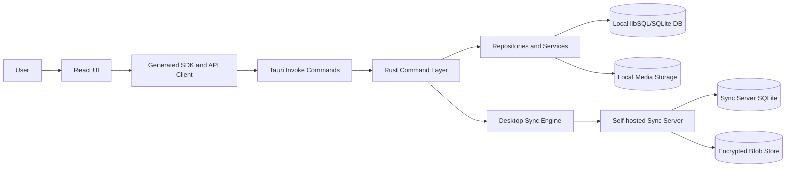

# Aether Architecture

## General Overview

Aether is a local-first desktop app with a separate optional sync server.

The repo is split into two main applications:

- `desktop/`: the Tauri desktop app. It contains the React frontend, generated TypeScript API client, Rust command layer, local database access, media handling, transcription, sync client, settings, and updater integration.
- `sync-server/`: a standalone Rust service. It stores encrypted sync changes and encrypted media blobs for enrolled devices.

The desktop app is the primary product. The sync server is infrastructure for users who want self-hosted encrypted multi-device sync.

Most product behavior lives in the desktop app. The React layer owns screens, interactions, navigation, and state orchestration. The Rust backend owns durable local state, command validation, database repositories, media storage, audio/transcription work, sync, and updater commands.

## Main Runtime Layers

### React Frontend

The frontend is a Vite/React app under `desktop/src`. It uses React Router for navigation, TanStack Query for server-state caching, generated SDK hooks for Tauri command calls, and local feature stores where needed.

The v1 product surface is intentionally narrow: journal, tasks, goals, settings, encrypted sync, and updater. Canvas, bookmarks, graph, journal audio/transcription, global search, embeddings management, and sync diagnostics are kept out of the visible v1 navigation unless they are intentionally completed in a later milestone.

### Tauri Desktop Backend

The Rust backend under `desktop/src-tauri` is the local application backend. It registers Tauri commands, exposes OpenAPI metadata, manages the local database, stores settings, handles media/audio, runs transcription providers, performs sync, and integrates the updater.

Frontend calls generally flow through `desktop/src/lib/api-client.ts` and generated SDK hooks into Tauri commands registered in `desktop/src-tauri/src/lib.rs`.

### Local Persistence And Services

The desktop backend uses database repositories for journal entries, tasks, goals, tags, bookmarks, links, canvas, search, settings, activity, media, and transcription records. Settings use an encryption helper for sensitive keys such as API keys and secrets.

Media files are stored outside ordinary table rows, with database metadata linking them back to app resources. Transcription jobs attach to media records and persist transcript status/results.

### Sync Server

The sync server is a standalone Axum service. It enrolls devices with a server seed phrase, issues per-device tokens, stores encrypted change batches in SQLite, stores encrypted blobs on disk, and notifies connected devices over WebSocket.

The server should not understand plaintext user data. Its main trust boundary is device enrollment and authenticated access to encrypted changes/blobs.

## Directory Map

### `.github/`

GitHub repository automation. The workflows cover platform builds, release checks, desktop release, and sync-server release. This is release infrastructure rather than product runtime code.

### `.vscode/`

Editor configuration for local development. It does not affect runtime behavior.

### `.cursor/`

Project planning, migration notes, and Cursor-specific rules. It contains useful historical implementation plans, but it is not the authoritative runtime architecture.

### `desktop/`

The main desktop application. It contains the React frontend, Tauri backend, public assets, generated build output, and JavaScript dependencies.

### `desktop/public/`

Static assets served by the frontend build, including fonts. These are bundled into the desktop UI.

### `desktop/dist/`

Generated frontend build output. Treat as artifact, not source.

### `desktop/node_modules/`

Installed JavaScript dependencies. Treat as vendor/artifact, not source.

### `desktop/src/`

Hand-authored frontend source plus generated client code. This is where the UI, routing, feature views, shared components, hooks, styles, and frontend utility code live.

### `desktop/src/aether-sdk/`

Generated TypeScript SDK and React Query hooks. It is the bridge between frontend features and the Tauri command API. Avoid editing manually unless the generation process is intentionally changed.

### `desktop/src/components/`

Shared frontend components. This includes editor components, shared app shell pieces, navigation, command palette, resource links, audio player, updater notification, and reusable controls.

### `desktop/src/context/`

React context providers. Theme context wraps app styling behavior, while updater context centralizes update checks, available update state, preferences, and download/install actions for the global update button and Settings > What's New.

### `desktop/src/features/`

Frontend feature modules and routes. This is the main product surface.

### `desktop/src/features/journal/`

Journal UI. It renders the main journal timeline, entry components, and invalidation helpers. Journal audio/transcription code exists, but its visible UI is hidden for v1.

### `desktop/src/features/tasks/`

Tasks and goals UI. It includes inbox, overdue tasks, goal-specific task views, task sidebar, task items, subtasks, and goal selectors. This is a v1 core feature.

### `desktop/src/features/settings/`

Settings UI. It currently covers preferences, sync, AI provider keys, and updater/What's New for the v1 surface. Journal audio/transcription code exists, but its visible UI is hidden for v1.

### `desktop/src/features/graph/`

Knowledge graph UI backed by resource links. It uses backend graph/link data and renders a visualization, but the route is hidden for v1 because the experience is not polished enough to ship as a visible surface.

### `desktop/src/features/bookmarks/`

Bookmarks route. The backend has substantial bookmark support, but the current frontend view is placeholder-level. The route is hidden for v1.

### `desktop/src/features/canvas/`

Canvas UI, store, types, and viewport components. Canvas has real implementation work, but it is out for v1. Hide routes, shortcuts, and navigation while leaving backend/data code intact unless a later cleanup is planned.

### `desktop/src/hooks/`

Frontend hooks for cross-cutting behavior such as theme, shortcuts, updater, sync data refresh, media blob loading, and journal creation. This layer coordinates UI behavior around shared app services.

### `desktop/src/lib/`

Frontend library helpers. The key piece is the Tauri API client route-to-command mapping used by generated hooks.

### `desktop/src/openapi/`

Frontend OpenAPI artifacts. Treat as generated/interface support rather than hand-authored product logic.

### `desktop/src/store/`

Frontend shared state. Use for state that is not naturally owned by a single route or query.

### `desktop/src/styles/`

Frontend styles. This supports app-level visual language and theme behavior.

### `desktop/src/types/`

Shared frontend TypeScript types, including updater types.

### `desktop/src/utils/`

Frontend utility functions, including query-client setup and small helpers.

### `desktop/src-tauri/`

The Rust/Tauri application. This is the desktop backend, packaging surface, migration owner, local service layer, and native integration point.

### `desktop/src-tauri/capabilities/`

Tauri permissions/capabilities configuration. This controls what the frontend is allowed to invoke or access in the desktop runtime.

### `desktop/src-tauri/gen/`

Generated Tauri schema output. Treat as artifact.

### `desktop/src-tauri/icons/`

Desktop and platform icons used in packaging.

### `desktop/src-tauri/migrations/`

Database migrations for the local app database. These define durable schema changes and are critical to release safety.

### `desktop/src-tauri/tests/`

Rust-side tests. Use this area for backend behavior that can be validated without launching the full UI.

### `desktop/src-tauri/tools/`

Developer tooling for the Tauri/Rust side. This is support code, not product runtime.

### `desktop/src-tauri/target/`

Rust build output. Treat as artifact.

### `desktop/src-tauri/src/`

Main Rust source for the desktop backend.

### `desktop/src-tauri/src/api/`

OpenAPI generation and API metadata for the command surface. This keeps the frontend SDK aligned with Tauri commands.

### `desktop/src-tauri/src/audio/`

Audio recording/preprocessing helpers. This supports journal audio and transcription.

### `desktop/src-tauri/src/bin/`

Additional Rust binary entrypoints if present. These are separate from the main Tauri app entrypoint.

### `desktop/src-tauri/src/commands/`

Tauri command modules. This is the main API surface used by the frontend. Commands cover activity, audio, bookmarks, canvas, entries, goals, links, search, settings, sync, tags, tasks, transcription, trash, embeddings, and updater.

### `desktop/src-tauri/src/db/`

Database connection, schema, migrations, models, and repositories. Repositories hold most durable data access behavior for local app state.

### `desktop/src-tauri/src/handlers/`

Backend handler code. This appears to support lower-level or legacy request handling around the command/API structure.

### `desktop/src-tauri/src/media/`

Media storage and retrieval. This manages file-backed data that is referenced by database rows and synchronized as encrypted blobs when sync is enabled.

### `desktop/src-tauri/src/openapi/`

Generated OpenAPI spec output for the desktop command API. Treat as generated.

### `desktop/src-tauri/src/settings/`

Settings service and encryption helper. Sensitive keys are encrypted when the setting name contains values like `api_key`, `auth_token`, `password`, or `secret`.

### `desktop/src-tauri/src/sync/`

Desktop sync engine. It reads local changes, encrypts payloads, pushes/pulls from the sync server, applies remote changes, manages media sync behavior, and tracks sync state.

### `desktop/src-tauri/src/transcription/`

Transcription providers, provider trait, model manager, and job queue. It supports OpenAI, Groq, local Whisper, and self-hosted providers at the backend level.

### `desktop/src-tauri/src/utils/`

Rust utility modules. This includes metadata extraction, embeddings helpers, model utilities, link parsing, logging helpers, and other cross-cutting support.

### `sync-server/`

Standalone sync server package. It can be released and deployed independently from the desktop app.

### `sync-server/src/`

Rust source for the sync server. The server defines startup, models, handlers/routes, and storage. Its runtime responsibilities are enrollment, device authentication, encrypted change storage, encrypted media blob storage, and WebSocket notifications.

### `sync-server/target/`

Rust build output. Treat as artifact.

## Backend Features Not Meaningfully Exposed In Frontend

### Bookmarks

The backend has bookmark CRUD, metadata extraction, tagging, archive support, repository logic, and generated API hooks. The frontend route currently resolves to a placeholder-level view, so the route is hidden for v1.

### Search

The backend has fuzzy/hybrid search and linkable resource search. Link autocomplete uses search for resource linking, but global command-palette search is not shipped as a visible v1 surface.

### Embeddings

The backend exposes embedding model list, download, verify, and delete commands. There is no meaningful frontend management surface. Defer for v1.

### Transcription Provider And Model Management

The backend can list and validate providers and manage local Whisper models. Journal audio/transcription code exists, but the visible journal audio UI and full provider/model management are hidden for v1.

### Sync Diagnostics

The backend exposes sync trigger check/test commands. These are diagnostic tools, not user-facing v1 features. Keep them hidden.

### Canvas

Canvas has backend and frontend implementation, but it is out for v1. Hide the route, shortcut, and navigation paths while leaving the code in place.

### Graph

The graph route has frontend and backend support through resource links, but the current visualization is placeholder-level. The route is hidden for v1 until the graph has a designed navigation path, empty state, labels, and resource-opening behavior.
