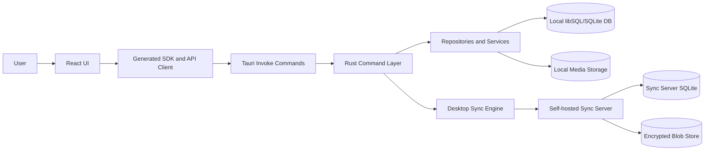

# Aether Architecture

## General Overview

Aether is a local-first desktop app with a separate optional sync server.

The repo is split into two main applications:

- `desktop/`: the Tauri desktop app. It contains the React frontend, generated TypeScript API client, Rust command layer, local database access, image/video media handling, local journal/task search, sync client, settings, and updater integration.
- `sync-server/`: a standalone Rust service. It stores encrypted sync changes and encrypted media blobs for enrolled devices.

```mermaid
flowchart LR
  User[User] --> React[React UI]
  React --> SDK[Generated SDK and API Client]
  SDK --> Tauri[Tauri Invoke Commands]
  Tauri --> Commands[Rust Command Layer]
  Commands --> Repos[Repositories and Services]
  Repos --> DB[(Local libSQL/SQLite DB)]
  Repos --> Media[(Local Media Storage)]
  Commands --> SyncClient[Desktop Sync Engine]
  SyncClient --> SyncServer[Self-hosted Sync Server]
  SyncServer --> SyncDB[(Sync Server SQLite)]
  SyncServer --> BlobStore[(Encrypted Blob Store)]
```

Most product behavior lives in the desktop app. The React layer owns screens, interactions, navigation, and state orchestration. The Rust backend owns durable local state, command validation, database repositories, media storage, local search, sync, and updater commands.

## V1 Surface Boundary

The v1 product surface is intentionally narrow:

- Journal writing and editing.
- Tasks, subtasks, goals, and goal instances.
- Activity tracking and heatmap data.
- Trash and restore workflows.
- Image/video media blobs.
- Local search over journal entries and tasks.
- Local search model setup.
- Settings for sync, search, updater, and diagnostics where present.
- Self-hosted encrypted sync and sync-server compatibility.
- OTA updater.

Canvas, bookmarks, graph, journal audio recording, transcription, AI journal enrichment, provider-key setup, transcription model management, resource-link APIs, bookmark metadata extraction, and broad global search result types are not v1 surfaces.

Existing migrations remain intact for installed-user compatibility. The sync layer may continue to recognize old entity names so older encrypted changes do not break, but those entities are not exposed through the v1 command or frontend surface.

## Main Runtime Layers

### React Frontend

The frontend is a Vite/React app under `desktop/src`. It uses React Router for navigation, TanStack Query for server-state caching, generated SDK hooks for Tauri command calls, and local feature stores where needed.

Visible v1 routes are limited to the journal, tasks/goals, trash, settings, onboarding, and supporting app shell behavior.

### Tauri Desktop Backend

The Rust backend under `desktop/src-tauri` is the local application backend. It registers Tauri commands, exposes OpenAPI metadata, manages the local database, stores settings, handles image/video media, performs sync, and integrates the updater.

Frontend calls generally flow through `desktop/src/lib/api-client.ts` and generated SDK hooks into Tauri commands registered in `desktop/src-tauri/src/lib.rs`.

### Local Persistence And Services

The desktop backend uses database repositories for journal entries, tasks, goals, tags, search documents, settings, activity, trash, media, and sync state. Settings use an encryption helper for sensitive values such as passwords, tokens, secrets, and sync credentials.

Media files are stored outside ordinary table rows, with database metadata linking them back to app resources. V1 surfaces image and video media blob access.

### Sync Server

The sync server is a standalone Axum service. It enrolls devices with a server seed phrase, issues per-device tokens, stores encrypted change batches in SQLite, stores encrypted blobs on disk, and notifies connected devices over WebSocket.

The server does not understand plaintext user data. Its main trust boundary is device enrollment and authenticated access to encrypted changes/blobs.

## Directory Map

### `desktop/`

The main desktop application. It contains the React frontend, Tauri backend, public assets, generated interface output, and JavaScript dependencies.

### `desktop/src/`

Hand-authored frontend source plus generated client code. This is where the UI, routing, feature views, shared components, hooks, styles, and frontend utility code live.

### `desktop/src/aether-sdk/`

Generated TypeScript SDK and React Query hooks. Avoid editing manually unless the generation process is intentionally changed.

### `desktop/src/components/`

Shared frontend components. This includes editor components, app shell pieces, navigation, command palette, updater notification, and reusable controls.

### `desktop/src/context/`

React context providers. Updater context centralizes update checks, available update state, preferences, and download/install actions.

### `desktop/src/features/`

Frontend feature modules and routes. V1 features live under journal, tasks, settings, onboarding, and supporting surfaces.

### `desktop/src/features/journal/`

Journal UI. It renders the main journal timeline, grid, editor interactions, and invalidation helpers.

### `desktop/src/features/tasks/`

Tasks and goals UI. It includes inbox, overdue tasks, goal-specific task views, task sidebar, task items, subtasks, and goal selectors.

### `desktop/src/features/settings/`

Settings UI. V1 settings cover preferences, sync, local search model setup, updater/What's New, and diagnostics where present.

### `desktop/src/hooks/`

Frontend hooks for cross-cutting behavior such as theme, shortcuts, updater, sync data refresh, media blob loading, and journal creation.

### `desktop/src/lib/`

Frontend library helpers. The key piece is the Tauri API client route-to-command mapping used by generated hooks.

### `desktop/src/openapi/`

Frontend OpenAPI artifacts. Treat as generated/interface support rather than hand-authored product logic.

### `desktop/src-tauri/`

The Rust/Tauri application. This is the desktop backend, packaging surface, migration owner, local service layer, and native integration point.

### `desktop/src-tauri/migrations/`

Database migrations for the local app database. These define durable schema changes and are preserved for compatibility.

### `desktop/src-tauri/src/api/`

OpenAPI generation and API metadata for the command surface. This keeps the frontend SDK aligned with Tauri commands.

### `desktop/src-tauri/src/commands/`

Tauri command modules. The v1 command surface covers activity, entries, goals, media, search, settings, sync, tags, tasks, trash, embeddings for local search, and updater.

### `desktop/src-tauri/src/db/`

Database connection, migrations, models, and repositories. Repositories hold durable data access behavior for local app state.

### `desktop/src-tauri/src/media/`

Media storage and retrieval for image/video blobs referenced by database rows and synchronized as encrypted blobs when sync is enabled.

### `desktop/src-tauri/src/sync/`

Desktop sync engine. It reads local changes, encrypts payloads, pushes/pulls from the sync server, applies remote changes, manages media sync behavior, and tracks sync state.

### `sync-server/`

Standalone sync server package. It can be released and deployed independently from the desktop app.
