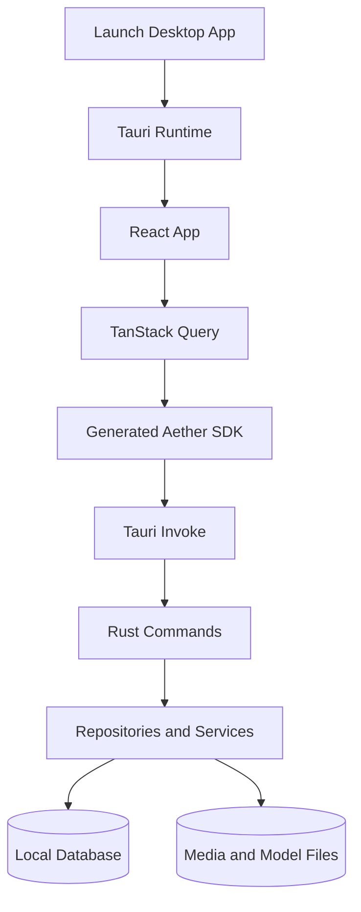
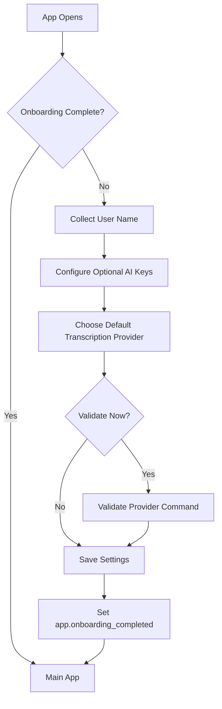
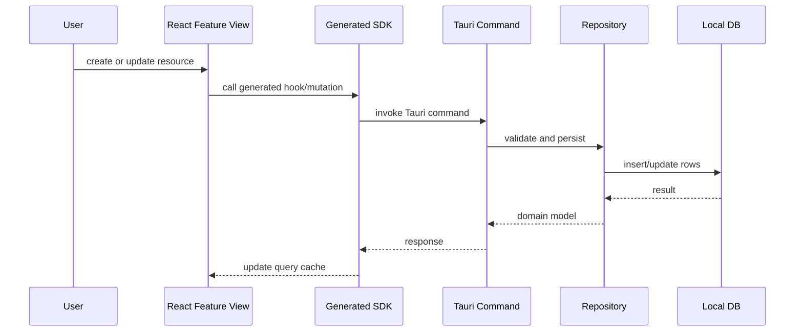
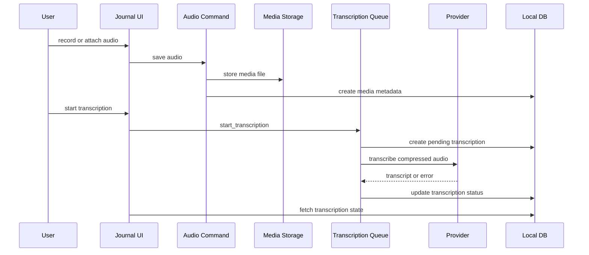
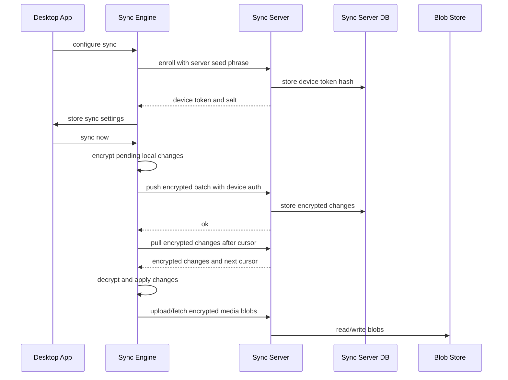
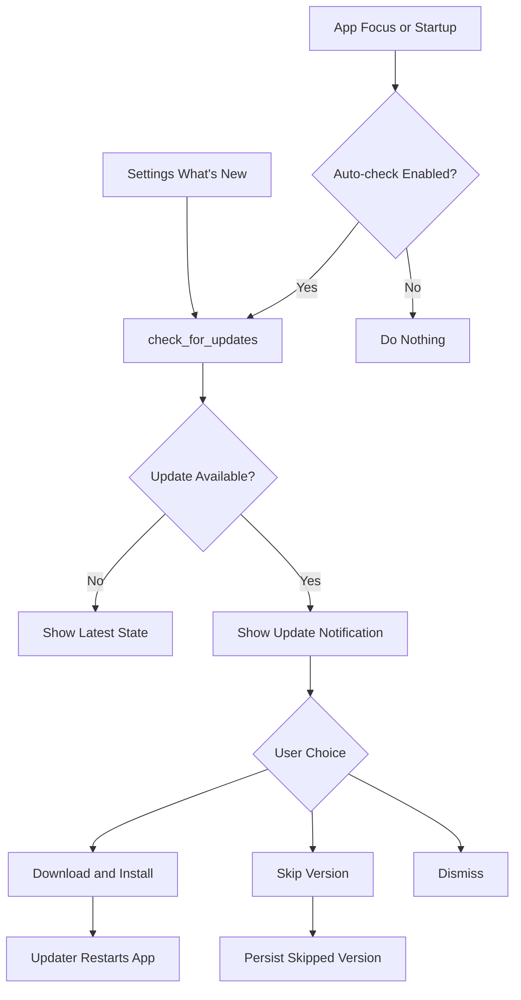
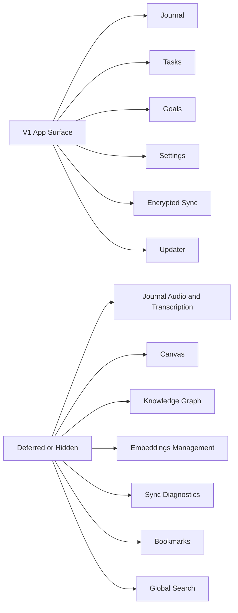

# Aether Flows

## App Runtime

```mermaid
flowchart TD
  Launch[Launch Desktop App] --> Tauri[Tauri Runtime]
  Tauri --> React[React App]
  React --> Query[TanStack Query]
  Query --> SDK[Generated Aether SDK]
  SDK --> Invoke[Tauri Invoke]
  Invoke --> Commands[Rust Commands]
  Commands --> Services[Repositories and Services]
  Services --> DB[(Local Database)]
  Services --> Files[(Media and Model Files)]
```

## First-Run Onboarding

```mermaid
flowchart TD
  Start[App Opens] --> Check{Onboarding Complete?}
  Check -->|Yes| Main[Main App]
  Check -->|No| Profile[Collect User Name]
  Profile --> AI[Configure Optional AI Keys]
  AI --> Provider[Choose Default Transcription Provider]
  Provider --> Validate{Validate Now?}
  Validate -->|Yes| ValidateProvider[Validate Provider Command]
  Validate -->|No| Save
  ValidateProvider --> Save[Save Settings]
  Save --> Mark[Set app.onboarding_completed]
  Mark --> Main
```

## Local CRUD Flow

```mermaid
sequenceDiagram
  participant U as User
  participant UI as React Feature View
  participant SDK as Generated SDK
  participant CMD as Tauri Command
  participant Repo as Repository
  participant DB as Local DB

  U->>UI: create or update resource
  UI->>SDK: call generated hook/mutation
  SDK->>CMD: invoke Tauri command
  CMD->>Repo: validate and persist
  Repo->>DB: insert/update rows
  DB-->>Repo: result
  Repo-->>CMD: domain model
  CMD-->>SDK: response
  SDK-->>UI: update query cache
```

## Audio Transcription Flow

```mermaid
sequenceDiagram
  participant U as User
  participant Journal as Journal UI
  participant Audio as Audio Command
  participant Media as Media Storage
  participant Queue as Transcription Queue
  participant Provider as Provider
  participant DB as Local DB

  U->>Journal: record or attach audio
  Journal->>Audio: save audio
  Audio->>Media: store media file
  Audio->>DB: create media metadata
  U->>Journal: start transcription
  Journal->>Queue: start_transcription
  Queue->>DB: create pending transcription
  Queue->>Provider: transcribe compressed audio
  Provider-->>Queue: transcript or error
  Queue->>DB: update transcription status
  Journal->>DB: fetch transcription state
```

## Sync Flow

```mermaid
sequenceDiagram
  participant D as Desktop App
  participant Engine as Sync Engine
  participant Server as Sync Server
  participant SDB as Sync Server DB
  participant Blob as Blob Store

  D->>Engine: configure sync
  Engine->>Server: enroll with server seed phrase
  Server->>SDB: store device token hash
  Server-->>Engine: device token and salt
  Engine->>D: store sync settings

  D->>Engine: sync now
  Engine->>Engine: encrypt pending local changes
  Engine->>Server: push encrypted batch with device auth
  Server->>SDB: store encrypted changes
  Server-->>Engine: ok
  Engine->>Server: pull encrypted changes after cursor
  Server-->>Engine: encrypted changes and next cursor
  Engine->>Engine: decrypt and apply changes

  Engine->>Server: upload/fetch encrypted media blobs
  Server->>Blob: read/write blobs
```

## Updater Flow

```mermaid
flowchart TD
  Settings[Settings What's New] --> Check[check_for_updates]
  AppFocus[App Focus or Startup] --> AutoCheck{Auto-check Enabled?}
  AutoCheck -->|Yes| Check
  AutoCheck -->|No| Idle[Do Nothing]
  Check --> Available{Update Available?}
  Available -->|No| Latest[Show Latest State]
  Available -->|Yes| Notify[Show Update Notification]
  Notify --> Choices{User Choice}
  Choices --> Install[Download and Install]
  Choices --> Skip[Skip Version]
  Choices --> Later[Dismiss]
  Install --> Restart[Updater Restarts App]
  Skip --> SaveSkip[Persist Skipped Version]
```

## V1 Feature Surface

```mermaid
flowchart LR
  V1[V1 App Surface] --> Journal[Journal]
  V1 --> Tasks[Tasks]
  V1 --> Goals[Goals]
  V1 --> Settings[Settings]
  V1 --> Sync[Encrypted Sync]
  V1 --> Updater[Updater]
  Deferred --> Audio[Journal Audio and Transcription]
  Deferred[Deferred or Hidden] --> Canvas[Canvas]
  Deferred --> Graph[Knowledge Graph]
  Deferred --> Embeddings[Embeddings Management]
  Deferred --> SyncDiagnostics[Sync Diagnostics]
  Deferred --> Bookmarks[Bookmarks]
  Deferred --> GlobalSearch[Global Search]
```
